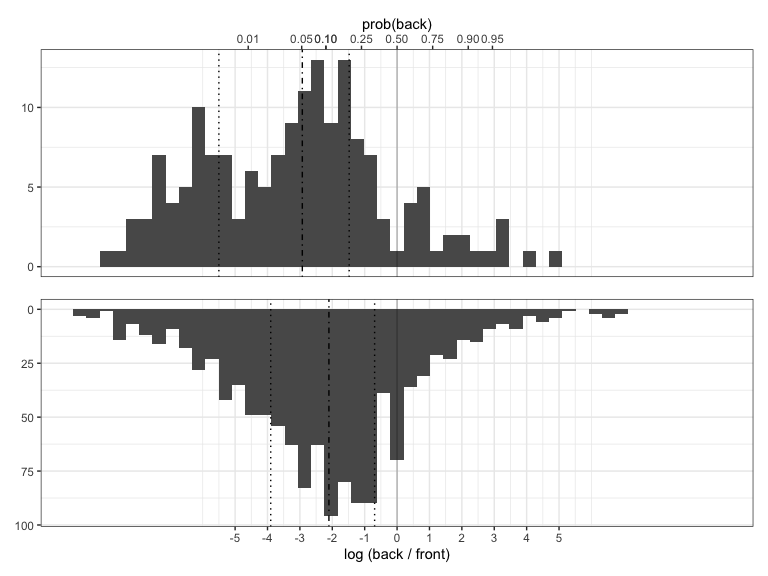
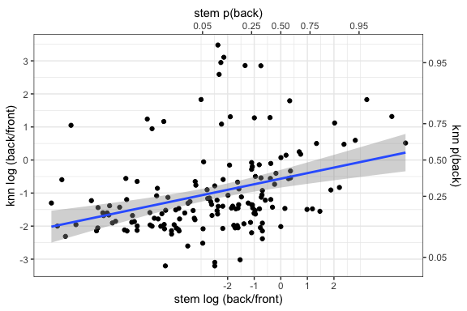
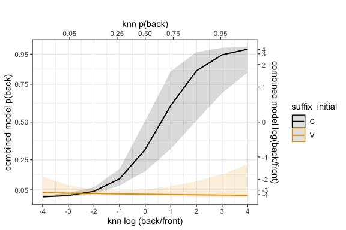
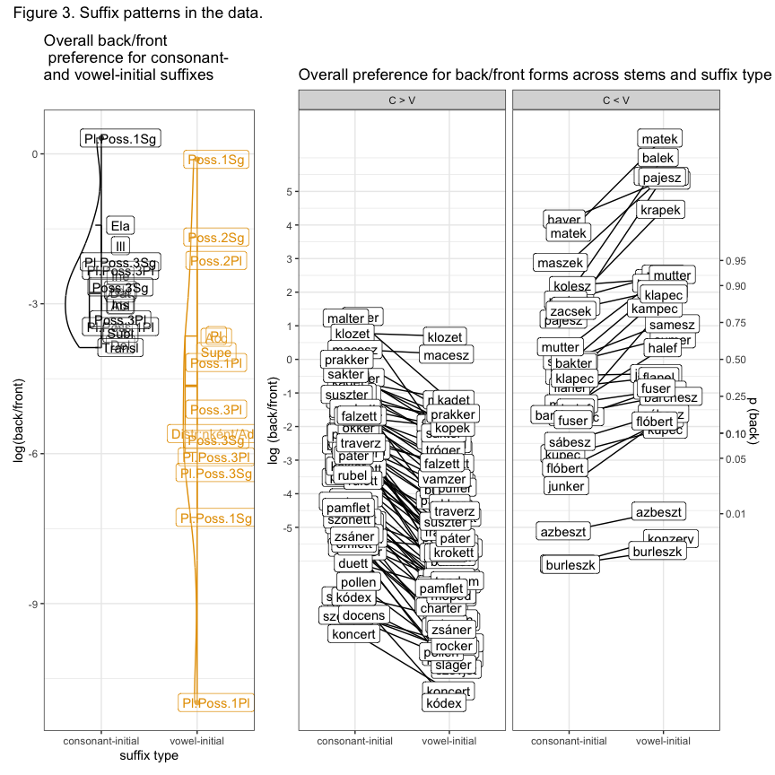
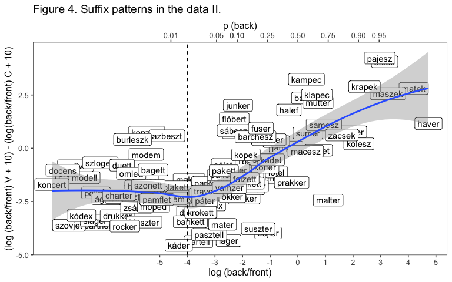
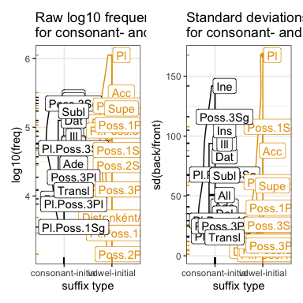

SI. The linking vowel should be lexically specified: Evidence from
Hungarian
================
Rácz, Péter & Rebrus, Péter
2024-06-05

## Notes

This readme uses Hungarian orthography. Hungarian is largely phonemic,
uses accents for vowel backness and length and digraphs for some
consonants. Notable differences are listed in Table 1.

| spelling | IPA |
|----------|-----|
| a        | ɒ   |
| e        | ɛ   |
| á        | aː  |
| é        | eː  |
| í        | iː  |
| ó        | oː  |
| ö        | ø   |
| ő        | øː  |
| ú        | uː  |
| ü        | y   |
| ű        | yː  |
| cs       | tʃ  |
| dz       | dz  |
| dzs      | dʒ  |
| gy       | ɟ   |
| ly       | j   |
| ny       | ɲ   |
| sz       | s   |
| ty       | c   |
| zs       | ʒ   |

Table 1: Spelling and IPA for Hungarian special characters.

We refer to the suffixed postposition as “suffix” so that different word
endings are different variants of the same suffix. We refer to the
unsuffixed stem and the lemma as “stem”. We refer to the suffixed stem
as “form”.

## Background

Hungarian shows vowel harmony. Noun suffixes typically have back- and
front-vowel variants which agree with the last vowel of the stem:
*Rómá-ban* (Rome-ine), *Berlin-nek* (Berlin-dat). There are exceptions:
*Rómaszerű* (‘Romelike’), *Berlinszerű* (‘Berlinlike’).

Historically, \<eéií\> are transparent and skipped by vowel harmony:
*Tallin-ban* (Tallin-loc), *Malé-ban* (Malé-ine). \<e\> has become
variable, meaning that back vowel + \<e\> stems vary between back and
front suffixes: *Tanger-nak* / *Tanger-nek* (Tanger-dat).

Suffixes differ in the presence or absence of a linking vowel connecting
them with the stem. Suffixes can be vowel-initial, like the plural, or
consonant-initial, like the dative: *Párizs-ok* (Paris-pl), *London-nak*
(London-dat).

Hayes, Siptár, Zuraw, and Londe (2009) demonstrate that that the shape
of the stem has specific effects on variable suffixes. Specifically,
they find that stems prefer front suffixes if

- the stem ends in a bilabial noncontinuant (\[p, b, m\]).
- the stem ends in a sibilant (\[s, z, š, ž, č, dž, ts\]).
- the stem ends in a coronal sonorant (\[n, ṉ, l, r\]).
- the stem ends in a sequence of two consonants.

## Research questions

Our focus is the back-front variation in back vowel + \<e\> stems. These
stems do not show free variation but rather exhibit stochastic patterns.
The role of the stem as a context for these patterns has been relatively
well understood. Our analysis focusses on the role of the suffix.

We have two research questions:

1.  How much can we predict back/front variation based on the stem
    alone?
2.  Can we improve on our predictions if we also include the suffixes?

In order to address these questions, we compiled a dataset of variable
Hungarian back vowel + \<e\> noun stems and built a K Nearest-Neighbour
model to categorise them using stem similarity. We then went on to add
suffix-evel information to the model to see if this improved its
accuracy.

## Methods

### Tools

We used the following R packages: ggplot2, patchwork, and sjPlot for
plots, lme4, performance, and broom for model comparison.

### Dataset

We compiled a frequency list from the Hungarian Webcorpus 2 ([Nemeskey
2020](https://hlt.bme.hu/en/resources/webcorpus2)). The Webcorpus
contains 1.8e+07 types and 8e+09 tokens. We filtered the frequency list
to include noun forms of two syllables with a back vowel + \<e\>. We
used a spellchecker (Ooms 2022) and hand-filtering to winnow the list.
We picked the 30 most common suffix types that co-occur with these
nouns. The resulting list has 200 stems and 4501 suffixed forms. All
stems are consonant-final.

A sample of the data for the stem *fotel* (armchair) can be seen in
Table 2.

| suffix   | form     | freq | suffix examples                |
|:---------|:---------|-----:|:-------------------------------|
| Pl       | fotelek  | 5282 | haverok, projektek             |
| Pl       | fotelok  |  754 | haverok, projektek             |
| Acc      | fotelet  |    1 | flóbertot, flóbertet/flőbörtöt |
| Ine      | fotelben | 8185 | panelban, projektben           |
| Ine      | fotelban | 4069 | panelban, projektben           |
| Ins      | fotellel |  807 | haverral, szoftverrel          |
| Ins      | fotellal |  274 | haverral, szoftverrel          |
| Poss.3Sg | fotelje  |  276 | haverja, modellje              |
| Poss.3Sg | fotelja  |  258 | haverja, modellje              |
| Poss.3Sg | fotele   |   96 | samesza, partnere              |
| Supe     | fotelen  |  263 | panelon, koncerten             |
| Supe     | fotelon  |  202 | panelon, koncerten             |
| Subl     | fotelre  |  505 | panelra, koncertre             |
| Subl     | fotelra  |  242 | panelra, koncertre             |
| Dat      | fotelnek |  363 | havernak, projektnek           |
| Dat      | fotelnak |   75 | havernak, projektnek           |
| Poss.1Pl | fotelünk |  234 | haverunk, partnerünk           |

Table 2: Sample long data for *dzsungel*

We restricted the data to suffixed forms that do show back / front
variation in the corpus, resulting in 164 stems and 2462 suffixed forms.
We went on to calculate the log odds ratio of back and front forms for
each suffixed form (`log( back / front )`), resulting in 1231 suffixed
pairs across 161 stems. The difference here arises because 3 stems do
vary but only across, not within suffixes.

A sample of the resulting data for *fotel* can be seen in Table 3.

| suffix      | back | front | log_odds_back |
|:------------|-----:|------:|--------------:|
| Poss.2Pl    |    9 |     6 |          0.41 |
| Ill         | 3232 |  3212 |          0.01 |
| Poss.3Sg    |  258 |   276 |         -0.07 |
| Supe        |  202 |   263 |         -0.26 |
| Poss.1Sg    |   90 |   143 |         -0.46 |
| Pl.Poss.1Sg |    1 |     2 |         -0.69 |
| Ine         | 4069 |  8185 |         -0.70 |
| Subl        |  242 |   505 |         -0.74 |
| Ela         | 2056 |  4503 |         -0.78 |
| Abl         |   27 |    68 |         -0.92 |

Table 3. Sample wide data for *fotel*

When we worked with stems, we simply summed the totals of back and front
variants per stem. This approach masks across-suffix variation. Another
approach, following Janda, Nesset, and Baayen (2010) would be to fit a
mixed model predicting back/front odds and estimating a random intercept
for stems and for suffixes. We could then extract the random intercept.
However, the correlation between the stem random intercepts and the raw
log odds is 0.99 and makes little practical difference in the analysis.

## K Nearest-Neighbours Model

We took the 164 varying stems and transcribed them using a simplified
phonetic transcription. This transcription replaced letter digraphs with
single characters (*szatyor* “bag” -\> \<saṯor\>). We calculated the log
odds of back / front forms for each stem by grouping the data across
stems and summing back and front counts across suffixes. We split the
stems into five frequency quantiles.

Our K-Nearest Neighbour learner was written in R. It matched a target
word to test words and predicted its behaviour based on the behaviour of
its nearest neighbours. It calculated the Levenshtein distance between
the transcribed test word and transcribed target words, arranged target
words from smallest to largest distance from the test word, and selected
the first k target words. Some target words might have the same
Levenshtein distance from the test word (e.g. the Levenshtein distance
between *hotel*, *motel*, and *fotel* “armchair” is 1), so the order of
target words within distance brackets was randomised. The learner then
summed over the back and front form counts for the k nearest neighbours
and calculated a total log odds. The learner returned this value as the
prediction for the test form. The learner used a leave-one-out fitting
method, comparing test forms to all training forms except the test form
itself.

An example with `k = 3` and the target word *fotel* can be seen in Table
4. The first columns shows the test word. The second column shows the
five closest neighbours to *fotel*: *hotel, motel, totem, notesz,
fater*. The summed back and front counts for each form are in the next
two columns (viz. there are, in total, 7722 back variants and 140832
front variants of *hotel* in the dataset). Given `k = 3`, we sum over
back and front forms for the first three and log the odds, which is
`log(7722+623+3=8348/140832+3386+142=144360) = -2.58` (or p = .07). This
is the predicted value for *fotel*. The true value is -.76 (p = .32), so
the learner is not particularly accurate in this example.

| test  | target | transcription | back |  front | distance |   k | sum back | sum front |  pred |
|:------|:-------|:--------------|-----:|-------:|---------:|----:|---------:|----------:|------:|
| fotel | hotel  | hotel         | 7722 | 140832 |        1 |   1 |          |           |       |
|       | motel  | motel         |  623 |   3386 |        1 |   2 |          |           |       |
|       | totem  | totem         |    3 |    142 |        2 |   3 |     8348 |    144360 | -2.58 |
|       | notesz | notes         |  628 |   3686 |        2 |   4 |          |           |       |
|       | fater  | fater         | 3133 |    190 |        2 |   5 |          |           |       |

Table 4. Example KNN for *fotel*.

Our learner differs from KNN learner used in categorisation problems and
machine learning. A more typical KNN learner provides a category label,
not a category weight. In addition, a more typical KNN learner will not
involve a random component, since distances in any given category space
are likely more fine-grained and so unique for every target item in the
training set. (Think of an RGB scale on which every unit of change in
R/G/B from a reference colour will define a distinct colour, however
small the difference is.)

Our learner had two parameters, `k`, the number of nearest neighbours
(possible values: 1,7,10,12,15), and `f`, the relative frequency of
stems in the training set (possible values: 1-5, where the training set
consists of forms in the f+ quantiles of the total training set).

For each parameter setting, we fit a binomial generalised linear model
predicting the back/front ratio for each stem from the KNN prediction
for that stem across all 164 stems. We used the linear model’s z-value
to select the best model. Since models only differed from one another by
the KNN parameter settings, this gave us the best KNN parameter
settings: `k = 7` and `f = 3`. This means that the best learner compared
the target form to its first seven nearest neighbours. The best learner
operated on the top 40% of the log odds distribution of training forms,
ignoring the less frequent training forms.

## Suffix model

The KNN makes predictions for stems only. In order to incorporate
suffix-specific information on some level, we marked whether a suffix
was consonant- or vowel-initial in our paired dataset. That is, whether
the suffix involved a linking vowel. We then went on to build
generalised linear mixed models that used stem-level information, KNN
predictions, and suffix-level information, presence of a linking vowel,
to predict the log odds of variable forms in the data.

We built four models, shown in Table 5. We used AIC, BIC, and a
likelihood ratio test of model fit to find the best random effect
structure for each model and to find the best model.

| formula                                                                        |      AIC |      BIC | R2_conditional | R2_marginal | RMSE |    Chi2 |   p |
|:-------------------------------------------------------------------------------|---------:|---------:|---------------:|------------:|-----:|--------:|----:|
| 1 + (1 \| stem) + (1 \| suffix)                                                | 21115.72 | 21131.07 |           0.68 |        0.00 | 0.15 |         |     |
| 1 + knn + (1 \| stem) + (1 + knn \| suffix)                                    | 20084.80 | 20115.49 |           0.68 |        0.07 | 0.15 | 1036.93 |   0 |
| 1 + knn + suffix_initial + (1 + suffix_initial \| stem) + (1 + knn \| suffix)  | 15612.50 | 15658.54 |           0.75 |        0.19 | 0.14 | 4478.30 |   0 |
| 1 + knn \* suffix_initial + (1 + suffix_initial \| stem) + (1 + knn \| suffix) | 15559.91 | 15611.06 |           0.76 |        0.18 | 0.14 |   54.59 |   0 |

Table 5. Models of the variable back + e pairs.

We go through the models one by one.

- Model 1 is our reference model. It groups data across stem and suffix.
- Model 2 includes the stem-level predictions of the best KNN learner.
  AIC and BIC show that learner predictions improve model fit over the
  null model.
- Model 3 adds suffix-level information to the formula, viz. whether the
  suffix is consonant- or vowel-initial.
- Model 4 tests the interaction of suffix-initial vowel and stem-level
  learner prediction. This model provides the best fit of the data.

## Results

Figure 1 shows the overall distribution of back/front variation across
varying stems (top) and forms (bottom) in the data.

<!-- -->

The horizontal axis shows the log odds of back / front variants per stem
(top) or suffixed form (bottom). Log odds are converted to probabilities
in the top axis for the reader’s convenience. The dot dash line shows
the median, the dotted line, the first and third quartile, in each
distribution. Both distributions skew heavily towards the left (towards
front variants).

We should note that these are the stems / forms that show any variation.
Even so, for a large number of items, this variation is so skewed that
we may as well consider them to exhibit no variation at all. This is
especially true for the left side of the distribution – any stem or form
below a log odds of -5 has more than 99.9% of all variants as front
variants.

This is, in fact, 142 out of 22 variable stems in our data. We fit a
binomial generalised linear model predicting back/front ratios across
stems from a boolean: whether the stem ends in any of these categories.
This has a robust effect on back/front preference (est = -2, 95%CI:
\[-2.02;-1.99\]), showing that the observations of Hayes et al. hold for
our data.

We used the KNN learner to test for stem-level similarity, that is,
whether stems that look like each other act like each other in
back/front variation. Many other instance-based or rule-based
categorisation models can capture this similarity effect. The main point
here is that it is relatively easy to find, even with a simple learning
method.

Figure 2 shows KNN predictions on the stem-level data.

<!-- -->

Modelling shows that stem-level similarity and the presence of a
suffix-initial vowel together predict back/front ratios across forms in
the data.

We better understand the role of the KNN predictions and the
suffix-initial vowel if we visualise the predictions of the best model
in Figure 3.

<!-- -->

The vertical axis shows the overall model prediction for the log odds of
back/front variants per stem-suffix pair. Log odds are converted to
probabilities on the right axis. The horizontal axis shows the effect of
the KNN learner prediction. Log odds are converted to probabilities on
the top axis. We see two trajectories, for stems with consonant-initial
suffixes (no linking vowel) and largely the same stems with
vowel-initial suffixes (linking vowel present). For stem-suffix pairs
with consonant-initial suffixes, this is a reliable predictor of
back/front preference in the data. For stem-suffix pairs with
vowel-initial suffixes, it does nothing.

This means two things: (a) consonant- and vowel-initial suffixes behave
differently in the data and (b) the behaviour of consonant-initial
suffixes can be explained by stem-based similarity, but this is not true
for the vowel-initial suffixes.

We can check (a) by (i) visualising log odds for specific consonant- and
vowel-initial suffixes as well as (ii) for the summed log odds of each
stem with consonant- and vowel-initial suffixes.

<!-- -->

The left panel of Figure 4 shows the summed back/front preferences for
each suffix on the vertical axis. Suffixes are grouped across suffix
type on the horizontal axis. Like stems, suffixes have an overall
preference for front variants. Consonant-initial suffixes, with no
linking vowel, have a larger preference for front forms than
vowel-initial suffixes, which have a linking vowel. Vowel-initial
suffixes also vary more. The right panel shows the same distinction for
stems: summed back/front preferences are on the vertical axis. Each stem
is marked twice, once for summed preference with consonant-initial and
once for vowel-initial suffixes (horizontal axis). The right panel is
split into two sub-panels: stems that overall prefer front vowels prefer
these even more when the suffix has a linking vowel (left). Stems that
overall are more likely to prefer back vowels, in turn, prefer these
even more with a linking vowel (right).

A different way of visualising the effect of the linking vowel on
back/front distributions is seen in Figure 5. The figure plots stem
back/front preference (horizontal axis) against the difference of
back/front preference for vowel-initial versus consonant-initial
suffixes. This difference is simply the consonant-initial log odds
subtracted from the vowel-initial log odds and expresses the way the
back/front ratio shifts in the presence / absence of a linking vowel.
Since we did not want to have negative values in the equation, we added
an arbitrary variable to both back/front log odds.

<!-- -->

What we see is that, ultimately, the vowel-initial asymmetry is
one-sided. The more a stem prefers back variants, the more it does so
with a linking vowel. This can be seen in the trend line in Figure 5: up
to around -4 (p = 0.018, the dashed vertical line), back forms are
extremely rare and the difference between vowel- and consonant-initial
suffixes is constant. Once we see meaningful back-front variation, the
difference is more and more pronounced as the overall rate of back forms
increases.

We provide a speculative discussion in the paper that builds this
synchronic distribution on diachronic grounds. In the meantime, we
should note that the distributions of vowel- and consonant-initial
suffixes themselves are very different in the data. Their overall
frequencies are similar, but the type-token distribution is much more
skewed for vowel-initial suffixes, where the plural, and, to a lesser
degree, the accusative are by far the most frequent. The differences
across consonant-initial suffixes are much less pronounced. This can be
seen in Figure 6. Each rectangle marks the raw frequency of a given
suffix in the data, and the colour marks whether the suffix is
consonant- or vowel-initial.

<!-- -->

As a result, back/front variability is also distributed differently
across the linking vowel divide. Vowel-initial suffixes are much less
variable than consonant-initial suffixes, with the single exception of
the plural, which, in turn, is much more variable.

<!-- -->
