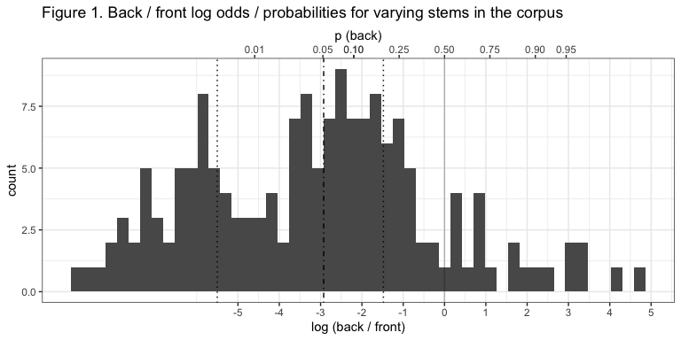

The linking vowel should be lexically specified: Evidence from Hungarian
================
Rácz, Péter & Rebrus, Péter
2024-01-28

## Notes

This readme uses Hungarian orthography. Hungarian is largely phonemic,
uses accents for vowel frontedness and length and digraphs for some
consonants. Notable differences are listed in Table 1

| spelling | IPA |
|----------|-----|
| a        | ɒ   |
| e        | ɛ   |
| á        | aː  |
| é        | eː  |
| í        | iː  |
| ó        | oː  |
| ö        | ø   |
| ő        | øː  |
| ú        | uː  |
| ü        | y   |
| ű        | yː  |
| cs       | tʃ  |
| dz       | dz  |
| dzs      | dʒ  |
| gy       | ɟ   |
| ly       | j   |
| ny       | ɲ   |
| sz       | s   |
| ty       | c   |
| zs       | ʒ   |

Table 1: Spelling and IPA for Hungarian special characters.

We refer to the suffixed postposition as “suffix” so that different word
endings are different variants of the same suffix. We refer to the
unsuffixed stem and the lemma as “stem”. We refer to the suffixed stem
as “form”.

## Background

Hungarian shows vowel harmony. Noun suffixes typically have back- and
front-vowel variants which agree with the last vowel of the stem:
*Rómá-ban* (Rome-ine), *Berlin-nek* (Berlin-dat).

Historically, \<eéií\> are transparent and skipped by vowel harmony:
*Tallin-ban* (Tallin-loc), *Malé-ban* (Malé-ine). \<e\> has become
variable, meaning that back vowel + \<e\> stems vary between back and
front suffixes: *Tanger-nak* / *Tanger-nek* (Tanger-dat).

Suffixes can be vowel-initial, like the plural, or consonant-initial,
like the dative: *Párizs-ok* (Paris-pl), *London-nak* (London-dat).

## Research questions

Our focus is the back-front variation in back vowel + \<e\> stems. These
stems do not show free variation but rather exhibit stochastic patterns.
The role of the stem as a context for these patterns has been relatively
well understood (Hayes Siptár Londe, Rebrus Törkenczy, Lukács). Our
analysis focusses on the role of the suffix.

We have three research questions:

1.  Does the suffix exert an influence on back/front variation?
2.  How do lexical patterns explain this influence?
3.  What is the best way to represent these patterns to provide
    explanatory adequacy?

In order to address these questions, we compiled a dataset of variable
Hungarian back vowel + \<e\> noun stems.

## Methods

We compiled a frequency list from the Hungarian Webcorpus 2 (Nemeskey
2020). The Webcorpus contains 1.8e+07 types and 8e+09 tokens. We
filtered the frequency list to include noun forms of two syllables with
a back vowel + \<e\>. We used a spellchecker (Ooms 2022) and
hand-filtering to winnow the list. We picked the 30 most common suffix
types that co-occur with these nouns. The resulting list has 200 stems
and 4501 suffixed forms. All stems are consonant-final.

A sample of the data for the stem *dzsungel* (jungle) can be seen in
Table 2.

| suffix   | form        |  freq | suffix examples       |
|:---------|:------------|------:|:----------------------|
| Pl       | dzsungelek  |  1010 | haverok, projektek    |
| Pl       | dzsungelok  |     1 | haverok, projektek    |
| Ine      | dzsungelben | 10604 | panelban, projektben  |
| Ine      | dzsungelban |   258 | panelban, projektben  |
| Ins      | dzsungellel |   528 | haverral, szoftverrel |
| Ins      | dzsungellal |    12 | haverral, szoftverrel |
| Poss.3Sg | dzsungele   |   509 | samesza, partnere     |
| Poss.3Sg | dzsungelje  |    19 | haverja, modellje     |
| Supe     | dzsungelen  |  1037 | panelon, koncerten    |
| Supe     | dzsungelon  |     3 | panelon, koncerten    |
| Subl     | dzsungelre  |   275 | panelra, koncertre    |
| Subl     | dzsungelra  |    14 | panelra, koncertre    |
| Dat      | dzsungelnek |   701 | havernak, projektnek  |
| Dat      | dzsungelnak |    21 | havernak, projektnek  |
| Poss.1Pl | dzsungelünk |    39 | haverunk, partnerünk  |
| All      | dzsungelhez |   146 | matekhoz, projekthez  |
| All      | dzsungelhoz |     2 | matekhoz, projekthez  |

Table 2: Sample long data for *dzsungel*

Note that the stem shows back / front variation with most suffix tags
(such as the inessive: *dzsungel-ben* n = 10604, *dzsungel-ban* n = 258,
“in the jungle”) but not all of them. For example, no back variant of
the Poss.1Pl is attested (*dzsungel-ünk* n = 39, *dzsungel-unk* n = 0,
“our jungle”).

We restricted the data to suffixed forms that do show back / front
variation in the corpus, resulting in 161 stems and 1231 suffixed forms.
We went on to calculate the log odds ratio of back and front forms for
each suffixed form (`log( back / front )`). A sample of the resulting
data for “dzsungel” can be seen in Table 3.

| suffix | back | front | log_odds_back |
|:-------|-----:|------:|--------------:|
| Pl     |    1 |  1010 |         -6.92 |
| Ine    |  258 | 10604 |         -3.72 |
| Ins    |   12 |   528 |         -3.78 |
| Supe   |    3 |  1037 |         -5.85 |
| Subl   |   14 |   275 |         -2.98 |
| Dat    |   21 |   701 |         -3.51 |
| All    |    2 |   146 |         -4.29 |
| Ill    |  136 |  3050 |         -3.11 |
| Del    |    9 |   103 |         -2.44 |
| Ela    |   41 |   896 |         -3.08 |

Table 3. Sample wide data for *dzsungel*

For each stem, we calculated the summed count of back / front variants
across (1) all forms, (2) forms with consonant-initial suffixes, (3)
forms with vowel-initial suffixes. As a result, we have three numbers
per stem to express how these vary

1.  in total,
2.  with consonant-initial suffixes,
3.  with vowel-initial suffixes.

## Results

164 out of 200 back vowel + \<e\> stems show back / front variation with
at least one suffix. These stems have a bias towards front forms. This
can be seen in Figure 1. The Figure is a histogram of the log odds of
back / front forms for variable stems. Probability is indicated on the
top horizontal axis.

<!-- -->

The median of the distribution is p = 0.051. 50% of variable stems are
either below p = 0.004 or above p = 0.186.

Stem preference is determined by lexical stratum. We can illustrate this
by sorting variable stems across back form preference and drawing the
top five and bottom five, as seen in Table 4.

|  no | stem     | intercept |      p |
|----:|:---------|----------:|-------:|
|   1 | haver    |    4.7303 | 0.9913 |
|   2 | matek    |    4.1942 | 0.9851 |
|   3 | fater    |    3.3443 | 0.9659 |
|   4 | maszek   |    3.2600 | 0.9630 |
|   5 | balek    |    3.1432 | 0.9586 |
| 156 | kódex    |   -7.8389 | 0.0004 |
| 157 | szoftver |   -8.0510 | 0.0003 |
| 158 | projekt  |   -8.2019 | 0.0003 |
| 159 | szovjet  |   -8.2899 | 0.0003 |
| 160 | docens   |   -8.5131 | 0.0002 |
| 161 | koncert  |   -8.9091 | 0.0001 |

Table 4. Top five and bottom five variable stems in the corpus

The top five stems (1-5) which are most likely to prefer a back suffix
are all informal words. These are either borrowings that traversed a
considerable semantic shift (*balek*, meaning “gullible idiot”, comes
from Turkish *balık*, “fish”, *haver*, meaning “pal”, comes from Hebrew
*חבר*, “friend”, *fater*, meaning “daddy”, comes from German *Vater*,
meaning “father”)

The bottom five (156-161, least likely to prefer a back suffix) are all
learned borrowings.

Forró (2013) proposed a diachronic explanation for the informal /
learned split. Historically, the language had open \[ɛ\] and closed
\[e\]. Back vowel + \<e\> nouns that entered the language primarily in
the written form were pronounced with \[ɛ\], those that were spoken
borrowings were picked up with \[e\]. \[ɛ\] nouns were more likely to
select back, \[e\] nouns, front suffixes. Later, the two \<e\>-s merged
but the variation persisted.

### 1. Does the suffix exert an influence on back/front variation?

So far, we have seen that specific stems show a preference for back or
front forms, and that this can be tied to historical lexical strata.
Stem-based variation further displays an apparent asymmetry across
consonant-initial versus vowel-initial suffixes. This can be seen in
Table 5, which shows a subset of suffixed forms for the mostly
back-preferring stem *haver* and the mostly front stem *koncert*.

| stem    | form         | suffix      | suffix_vowel | suffix_initial |  freq |
|:--------|:-------------|:------------|:-------------|:---------------|------:|
| haver   | haverról     | Del         | back         | C              |    62 |
| haver   | haverről     | Del         | front        | C              |    15 |
| haver   | haverjaink   | Pl.Poss.1Pl | back         | C              |   235 |
| haver   | haverjeink   | Pl.Poss.1Pl | front        | C              |     1 |
| haver   | haverjaim    | Pl.Poss.1Sg | back         | C              |  2007 |
| haver   | haverjaik    | Pl.Poss.3Pl | back         | C              |   646 |
| haver   | haverjai     | Pl.Poss.3Sg | back         | C              |  4757 |
| haver   | haverjei     | Pl.Poss.3Sg | front        | C              |     4 |
| haver   | haverjuk     | Poss.3Pl    | back         | C              |   467 |
| haver   | haverjük     | Poss.3Pl    | front        | C              |     4 |
| haver   | haverra      | Subl        | back         | C              |   214 |
| haver   | haverre      | Subl        | front        | C              |     5 |
| haver   | haverok      | Pl          | back         | V              | 20730 |
| haver   | haverek      | Pl          | front        | V              |   140 |
| haver   | havereink    | Pl.Poss.1Pl | front        | V              |     2 |
| haver   | havereim     | Pl.Poss.1Sg | front        | V              |     9 |
| haver   | haveraim     | Pl.Poss.1Sg | back         | V              |     2 |
| haver   | haverei      | Pl.Poss.3Sg | front        | V              |    12 |
| haver   | haverai      | Pl.Poss.3Sg | back         | V              |     2 |
| haver   | haverunk     | Poss.1Pl    | back         | V              |  1031 |
| haver   | haverünk     | Poss.1Pl    | front        | V              |    13 |
| haver   | haverotok    | Poss.2Pl    | back         | V              |   127 |
| haver   | haverük      | Poss.3Pl    | front        | V              |     2 |
| haver   | haveruk      | Poss.3Pl    | back         | V              |     1 |
| haver   | haveron      | Supe        | back         | V              |    51 |
| haver   | haveren      | Supe        | front        | V              |     1 |
| koncert | koncertről   | Del         | front        | C              | 12315 |
| koncert | koncertról   | Del         | back         | C              |     4 |
| koncert | koncertjeink | Pl.Poss.1Pl | front        | C              |  1605 |
| koncert | koncertjeim  | Pl.Poss.1Sg | front        | C              |   349 |
| koncert | koncertjeik  | Pl.Poss.3Pl | front        | C              |  2638 |
| koncert | koncertjei   | Pl.Poss.3Sg | front        | C              |  9959 |
| koncert | koncertjük   | Poss.3Pl    | front        | C              |  7556 |
| koncert | koncertjuk   | Poss.3Pl    | back         | C              |    15 |
| koncert | koncertre    | Subl        | front        | C              | 50442 |
| koncert | koncertra    | Subl        | back         | C              |    18 |
| koncert | koncertek    | Pl          | front        | V              | 94772 |
| koncert | koncerteink  | Pl.Poss.1Pl | front        | V              |     5 |
| koncert | koncerteim   | Pl.Poss.1Sg | front        | V              |     1 |
| koncert | koncertei    | Pl.Poss.3Sg | front        | V              |    11 |
| koncert | koncertünk   | Poss.1Pl    | front        | V              |  5800 |
| koncert | koncertunk   | Poss.1Pl    | back         | V              |    10 |
| koncert | koncertetek  | Poss.2Pl    | front        | V              |   583 |
| koncert | koncertük    | Poss.3Pl    | front        | V              |    34 |
| koncert | koncerten    | Supe        | front        | V              | 86590 |
| koncert | koncerton    | Supe        | back         | V              |     4 |

Table 5. Delative, plural, sublative, and superlative suffixed forms for
*haver* and *koncert*

When we look at *haver*, we see that it overwhelmingly prefers back
suffixes (as expected). In addition, this is even more marked with
vowel-initial versus consonant-initial suffixes. For instance, the
back-front ratio for the consonant-initial delative (*haverr\[óő\]l*) is
62/15. In contrast, for the vowel-initial superessive (*haver\[oe\]n*),
it is 51/1. The behaviour of *koncert*, which has an overall front
preference with the consonant-initial suffixes, has a front / back ratio
of 86590 / 4 for the superessive (*koncert\[oe\]n*), and is not attested
in the corpus with a back vowel in the delative (*koncertről*) and the
plural (*koncertek*) at all.

Even if we keep our focus on the set of stems that do vary with at least
one consonant-initial and one vowel-initial suffix, this overall trend
is visible. This can be seen in Figure 2.

<!-- -->

The figure is split into two panels for the sake of legibility. The left
panel shows stems that show a stronger back-preference with
vowel-initial versus consonant-initial suffixes, the right panel, the
other way round. In each panel, the two columns show the stem log odds
with vowel-initial and consonant-initial suffixes only. Each line
expresses the ratio of back preference with vowel- versus
consonant-initial suffixes. For *haver*, seen on top in the left, this
is very much a positive relationship. For *koncert*, seen at the bottom
in the right, this is a weaker negative relationship. Note that this is
the set in which each stem varies with at least one consonant- and one
vowel-initial suffix. Even so, the tails of the distribution show very
strong back/front preference, where `p(back)` is below .01 or above .99.

What we see is an interactive, rather than additive, relationship
between stem-level and suffix-level variation. If the stem prefers back
suffixes, this is more pronounced with vowel-initial suffixes. If it
prefers front suffixes, this, in turn, is also more pronounced with
vowel-initial suffixes.

We can operationalise this relationship in two steps. First, we can
subtract the vowel-initial log odds from the consonant-initial log odds
to express the ratio of the two. We need to add an arbitrary integer to
each log odds first to make sure we capture absolute differences, so we
calculate the difference for each stem using the formula
`( log (back / front) for vowel-initial suffixes + 10 ) - ( log (back / front) for consonant-initial suffixes + 10 )`.
The result will be a larger, negative value for *haver* (where the
consonant-initial log odds are smaller than the vowel-initial log odds)
and a smaller, positive value for *koncert* (where the consonant-initial
log odds are larger than the vowel-initial log odds). We can then plot
this value against the overall stem preference for back / front
suffixes. This can be seen in Figure 3.

<!-- -->

We find a non-linear relationship. Stems that show a strong preference
for front suffixed forms (the *koncert* category) show this about
equally with consonant- and vowel-initial suffixes. Stems that show a
strong preference for back suffixed forms (the *haver* category) show an
exacerbated preference with vowel-initial suffixes.

Given the front-bias of the distribution, this translates to a linear
increase across stems that show meaningful variation (p \> 0.01, the
gray line in Figure 3). We can quantify this by subsetting the stems to
those right of the gray line in Figure 3 and testing the correlation
between the overall preference (x axis) and the preference difference (y
axis). The correlation is robustly positive (r = 0.71, 95%CI
\[0.57;0.8\], using a two-sided Pearson correlation).

This shows that stem-level preference has a significant relationship
with the change between vowel- and consonant-suffix preference across
variable stems. Vowel-initial suffixes magnify the overall pattern.

### 2. How do lexical patterns explain this influence?

When we look at back vowel + \<e\> stems, we find that some of these
stems prefer back-vowel suffixed forms in general. We also find that if
a stem prefers back-vowel suffixes in general, it will do so even more
with vowel-initial suffixes, specifically.

Why do we see an asymmetry between vowel-initial and consonant-initial
suffixes? What lexical patterns does this asymmetry represent? In order
to answer this question, we have to first look at the distribution of
the suffixes themselves, putting the stems aside. Overall, there is
roughly the same amount of consonant- and vowel-initial suffix types in
our dataset. Their frequency distribution is very different: the two
most frequent suffixes are the plural and the accusative, and these
happen to be both vowel-initial. The plural in itself is about 30% of
all forms and 50% of all forms with a vowel-initial suffix. This can be
seen in Figure 4. Each area is labelled with the name of a given suffix
type and represents raw frequency in the entire dataset. The two
supersets are vowel-initial (dark gray) and consonant-initial suffixes
(light gray).

<!-- -->

For any given stem, the vast majority of back / front variation in
vowel-initial suffixes will likely come from the plural. For
consonant-initial suffixes, this will be more evened out, with multiple
suffixes equally contributing to variation. That is, stems vary more
across consonant-initial suffixes.

We can express this by calculating the standard deviation of the back /
front variation for each stem across vowel- and consonant-initial
suffixes.

We can calculate stem variance standard deviations across
consonant-initial versus vowel-initial suffixes using the formula
`sqrt(n * p * (1 - p))` where n is the number of forms per stem and
suffix type and p is the overall probability of back forms. We can plot
the distribution of standard deviations for consonant-initial and
vowel-initial suffixes across stems and suffixes that do show variation.
This can be seen in Figure `r`fcounter\`. The figure shows the
distribution of stem standard deviations (horizontal axis) across vowel-
and consonant-initial suffixes (vertical axis).

<!-- -->

Consonant-initial forms are more variable. This is especially prominent
if we include all stems and all suffixes in the dataset, including those
that do not show variation, as seen in Figure 6.

<!-- -->

The difference is significant in either case (varying forms: t = 3.67,
95%CI \[\`1.2;6.14\], all forms: t = 4.02, 95%CI \[2.1;5.94\], using a
two-sided t test.) (This has been revealed to me in a dream on
2024-01-26.)

### 3. What is the best way to represent these patterns to provide explanatory adequacy?

We found that stems that prefer the back vowel will do so even more with
vowel-initial suffixes. We went on to argue that this can be tied to the
variability of vowel-initial versus consonant-initial suffixes. A
consonant-initial suffix can be one of any number of things. A
vowel-initial suffix is overwhelmingly likely to be the plural, or, to a
lesser extent, the accusative. How do these two observations belong
together?

This can be explained by looking at the plural and the accusative. Both
show allomorphy with consonant- and vowel-final stems. They have no
linking vowel if the stem ends in a vowel: *franciá-k* (French-pl) “the
french”, *franciá-t* (French-acc). The plural does otherwise, while the
accusative is sensitive to the stem-final consonant: *angol-ok*
(English-pl), *angol-t* (English-acc), *svéd-ek* (Swedish-pl), *svéd-et*
(Swedish-acc). The presence of the linking vowel can be predicted from
the stem.

The specific linking vowel is also predictable from the stem: both the
plural and the accusative show back/front and rounding harmony:
*svéd-ek*, *görög-ök* (Greek-pl), *ukrán-ok* (Ukranian-pl). As a result,
traditional descriptions of Hungarian suffixation (Siptár & Törkenczy
2000) assume that the linking vowel is set by a grammatical constraint
or rule. A lexical specification would be entirely redundant.

The patterns of back vowel + \<e\> stems suggest otherwise. The
vowel-initial suffixes overwhelmingly belong to a few types, mainly the
plural and the accusative. These types, then, exert additional influence
on variation: when they go with back stems, they will be even more
likely to be back. When they go with front stems, they will be even more
likely to be front. This account is only possible, however, if we regard
the linking vowel as a part of the suffix – that is, if we assume
detailed representations for noun suffixation in Hungarian.

We can test this if, following Janda, Nesset & Baayen (2010), we fit two
Generalised Linear Mixed Models (Bates 2015) predicting the proportion
of back / front forms, estimating only an overall intercept. Model 1
also estimates a random intercept (grouping factor) for each stem and
each suffix type (`cbind(back,front) ~ 1 + (1|stem) + (1|suffix)`)
across all stems. Model 2 only estimates a random intercept for stem
(`cbind(back,front) ~ 1 + (1|stem)`). If suffixes determine back/front
variation in stem, we expect Model 1 to provide a better fit than Model
2, even taking into account its additional complexity.

This is indeed what we find: the more complex model provides a better
fit (Chisq = 25028.52, p \< .001, using a likelihood test).
