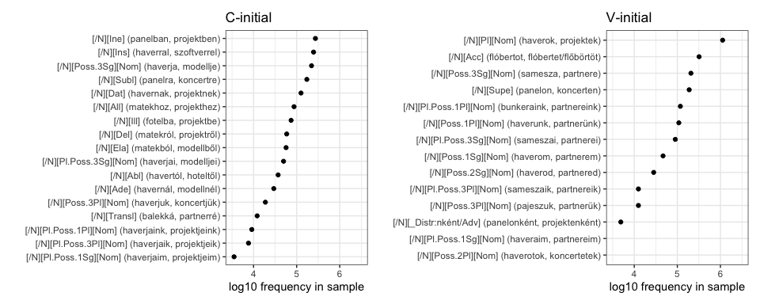

The linking vowel should be lexically specified: Evidence from Hungarian
================
Rácz, Péter
2024-01-18

## Background

Hungarian suffixation shows vowel harmony. Noun postpositions typically
have back- and front-suffix variants which are selected to agree with
the last vowel of the stem: “Rómában” (Rome.loc), “Berlinnek”
(Berlin.dat).

Historically, \[eéií\] are transparent and skipped by vowel harmony:
“Tallinban” (Tallin.loc), “Maléban” (Malé.loc). \[e\] has become
variable, meaning that back vowel + \[e\] stems vary between back and
front suffixes: “Tangernek” (Tanger.dat).

1.  Is variation sensitive to the stem?
2.  Is variation sensitive to the suffix?
3.  How should variation be lexically specified?

## Methods

We compiled a frequency list from the Hungarian Webcorpus 2 (Nemeskey
2020). The Webcorpus contains 18279298 types and 8570080167 tokens. We
filtered the frequency list to include noun forms of two syllables with
a back vowel and \[e\]. We used a spellchecker (Ooms 2022) and
hand-filtering to winnow the list. We picked the 30 most common
postpositions (noun suffixes) that co-occur with these nouns. The
resulting list has 210 stems and 4511 suffixed forms.

A sample of the data for the stem “dzsungel” (jungle) can be seen below:

| xpostag                   | form        |  freq | examples              |
|:--------------------------|:------------|------:|:----------------------|
| \[/N\]\[Pl\]\[Nom\]       | dzsungelek  |  1010 | haverok, projektek    |
| \[/N\]\[Pl\]\[Nom\]       | dzsungelok  |     1 | haverok, projektek    |
| \[/N\]\[Ine\]             | dzsungelben | 10604 | panelban, projektben  |
| \[/N\]\[Ine\]             | dzsungelban |   258 | panelban, projektben  |
| \[/N\]\[Ins\]             | dzsungellel |   528 | haverral, szoftverrel |
| \[/N\]\[Ins\]             | dzsungellal |    12 | haverral, szoftverrel |
| \[/N\]\[Poss.3Sg\]\[Nom\] | dzsungele   |   509 | samesza, partnere     |
| \[/N\]\[Poss.3Sg\]\[Nom\] | dzsungelje  |    19 | haverja, modellje     |
| \[/N\]\[Supe\]            | dzsungelen  |  1037 | panelon, koncerten    |
| \[/N\]\[Supe\]            | dzsungelon  |     3 | panelon, koncerten    |
| \[/N\]\[Subl\]            | dzsungelre  |   275 | panelra, koncertre    |
| \[/N\]\[Subl\]            | dzsungelra  |    14 | panelra, koncertre    |
| \[/N\]\[Dat\]             | dzsungelnek |   701 | havernak, projektnek  |
| \[/N\]\[Dat\]             | dzsungelnak |    21 | havernak, projektnek  |
| \[/N\]\[Poss.1Pl\]\[Nom\] | dzsungelünk |    39 | haverunk, partnerünk  |
| \[/N\]\[All\]             | dzsungelhez |   146 | matekhoz, projekthez  |
| \[/N\]\[All\]             | dzsungelhoz |     2 | matekhoz, projekthez  |

Sample long data for “dzsungel”

Note that the stem shows back / front variation with most suffix tags
(such as the inessive: “dzsungelben” n = 10604, “dzsungelban” n = 258,
“in the jungle”) but not all of them. For example, no back variant of
the 1pl.poss is attested (“dzsungelünk” n = 39, “dzsungelunk” n = 0,
“our jungle).

We restricted the data to suffixed forms that do show back / front
variation in the corpus, resulting in 161 stems and 1231 suffixed forms.
We went on to calculate the log odds ratio of back and front forms for
each suffixed form. A sample of the resulting data for “dzsungel” can be
seen below:

| xpostag             | back | front | log_odds_back |
|:--------------------|-----:|------:|--------------:|
| \[/N\]\[Pl\]\[Nom\] |    1 |  1010 |         -6.92 |
| \[/N\]\[Ine\]       |  258 | 10604 |         -3.72 |
| \[/N\]\[Ins\]       |   12 |   528 |         -3.78 |
| \[/N\]\[Supe\]      |    3 |  1037 |         -5.85 |
| \[/N\]\[Subl\]      |   14 |   275 |         -2.98 |
| \[/N\]\[Dat\]       |   21 |   701 |         -3.51 |
| \[/N\]\[All\]       |    2 |   146 |         -4.29 |
| \[/N\]\[Ill\]       |  136 |  3050 |         -3.11 |
| \[/N\]\[Del\]       |    9 |   103 |         -2.44 |
| \[/N\]\[Ela\]       |   41 |   896 |         -3.08 |
| \[/N\]\[Ade\]       |    1 |    29 |         -3.37 |
| \[/N\]\[Transl\]    |    7 |   356 |         -3.93 |

Sample wide data for “dzsungel”

We wanted to gauge the extent of variation for each stem Summing over
the back / front suffixed forms per stem across all postags does not
provide an accurate picture of this because the suffixes themselves vary
in both raw frequency and the ratio of back / front forms. Instead,
following Janda, Nesset & Baayen (2010), we fit a Generalised Linear
Mixed Model (Bates 2015) predicting the proportion of back / front
forms, estimating only an overall intercept as well as a random
intercept (grouping factor) for each stem and each suffix type. We then
extracted the stem intercept and used this instead of the log odds of
total counts per stem We did this across all suffixed forms, as well as
only for consonant-initial and vowel-initial suffixes, respectively. As
a result, we have three numbers per stem to express how these vary (a)
in total, (b) with consonant-initial suffixes, (c) with vowel-initial
suffixes. We justify this split below.

We wanted to know whether form-based similarity drives variation across
stems In order to find out, we split the stems in two categories: “back”
if the stem intercept was above 0 and “front” if it was equal to or
below 0. We went on to take all varying stems, transcribe them using a
simple segment-to-character script, calculated Levenshtein distances
between each possible pair of stems, and then used the resulting
distance matrix to fit a very simple K-nearest neighbours model. The
model takes each form as a target form, identifies all other forms with
the smallest Levenshtein distance to the target form, and then makes a
category prediction for the target form based on the majority label in
this filtered training set of nearest neighbours.

## Results

The resulting data look like this:

| stem     | intercept | C intercept | V intercept |
|:---------|----------:|------------:|------------:|
| koncert  |     -6.01 |       -5.88 |       -6.35 |
| sláger   |     -3.62 |       -2.88 |       -5.23 |
| klaszter |     -2.54 |       -2.32 |       -3.69 |
| azbeszt  |     -1.86 |       -2.26 |       -1.20 |
| latex    |     -0.66 |       -0.50 |       -1.95 |
| krokett  |     -0.27 |        0.11 |       -1.40 |
| bunker   |      0.37 |        0.44 |       -0.01 |
| flóbert  |      1.23 |        0.24 |        2.13 |
| fuser    |      2.37 |        1.51 |        3.08 |
| pajesz   |      3.81 |        3.71 |        3.50 |

Random intercepts based on all suffixed forms, C-initial suffixes only,
and V-initial suffixes only.

Since the intercept values come from models predicting log odds, these
themselves can be very roughly interpreted as expressing log odds
ratios. This, in turn, means that, even in the set of lemmata that show
back / front variation, some lemmata have an extreme preference for back
or front suffixes. This can be seen in the figure below:

<!-- -->

50% of the stems are either below p = 0.15 or above p = 0.84.

### Is variation tied to the stem?

We used our simple nearest neighbours model to see whether form-based
similarity predicts stem behaviour. Recall that we split the stems into
two discrete categories, “back” (above 0 in the figure above) and
“front” (below zero in the figure above). We then used the closest stems
for each stem (excluding the stem itself) to predict what category the
stem should be in. If this simple method can predict stem behaviour with
an accuracy that is above chance, that strongly suggests that stems that
look a certain way behave a certain way.

Model predictions are significantly correlated with category labels
(Chisq = 21.19, p \> 0.0001). This means that stem-level variation is
not arbitrary – it is predicted by the phonological attributes of the
stem.

One explanation for this stem-level specification of variation is
diachronic (Forró 2013). Back vowel + \[e\] nouns that entered the
language primarily in writing are much more likely to prefer
front-suffixes, while those that were borrowed in the spoken register
prefer back-suffixes. This can be illustrated by a sample of the stems
that show strongest back- versus front-preference.

| stem     | intercept |     p |
|:---------|----------:|------:|
| koncert  |    -6.009 | 0.002 |
| docens   |    -5.998 | 0.002 |
| projekt  |    -5.433 | 0.004 |
| modell   |    -4.944 | 0.007 |
| szoftver |    -4.848 | 0.008 |
| krapek   |     4.820 | 0.992 |
| balek    |     5.194 | 0.994 |
| fater    |     5.400 | 0.996 |
| maszek   |     6.293 | 0.998 |
| matek    |     6.830 | 0.999 |
| haver    |     7.858 | 1.000 |

Top five and bottom five variable stems in the corpus

The top 5 forms (with a very low intercept, that is, a very strong
preference for front forms) are all learned borrowings (koncert, docens,
projekt, modell, szoftver). In contrast, the five bottom forms are all
informal (balek, fater, maszek, matek, haver): these are either
borrowings with a considerable semantic shift (“balek”, meaning
“gullible idiot”, comes from Turkish “balık”, “fish”, “haver”, meaning
“pal”, comes from Hebrew “חבר”, “friend”, “fater”, meaning “daddy”,
comes from German “Vater”, meaning “father”).

### Is variation tied to the suffix?

Stem-based variation shows an apparent asymmetry across
consonant-initial versus vowel-initial suffixes. This can be seen in the
table below, which shows a subset of suffixed forms for the “back” stem
“haver” and the “front” stem “koncert”.

| lemma   | form       | xpostag             | suffix_vowel | suffix_initial |  freq |
|:--------|:-----------|:--------------------|:-------------|:---------------|------:|
| haver   | haverról   | \[/N\]\[Del\]       | back         | C              |    62 |
| haver   | haverről   | \[/N\]\[Del\]       | front        | C              |    15 |
| haver   | haverra    | \[/N\]\[Subl\]      | back         | C              |   214 |
| haver   | haverre    | \[/N\]\[Subl\]      | front        | C              |     5 |
| haver   | haverok    | \[/N\]\[Pl\]\[Nom\] | back         | V              | 20730 |
| haver   | haverek    | \[/N\]\[Pl\]\[Nom\] | front        | V              |   140 |
| haver   | haveron    | \[/N\]\[Supe\]      | back         | V              |    51 |
| haver   | haveren    | \[/N\]\[Supe\]      | front        | V              |     1 |
| koncert | koncertről | \[/N\]\[Del\]       | front        | C              | 12315 |
| koncert | koncertról | \[/N\]\[Del\]       | back         | C              |     4 |
| koncert | koncertre  | \[/N\]\[Subl\]      | front        | C              | 50442 |
| koncert | koncertra  | \[/N\]\[Subl\]      | back         | C              |    18 |
| koncert | koncertek  | \[/N\]\[Pl\]\[Nom\] | front        | V              | 94772 |
| koncert | koncerten  | \[/N\]\[Supe\]      | front        | V              | 86590 |
| koncert | koncerton  | \[/N\]\[Supe\]      | back         | V              |     4 |

Delative, plural, sublative, and superlative suffixed forms for “haver”
and “koncert”

When we look at “haver”, we see that it overwhelmingly prefers back
suffixes (as expected). In addition, this is even more marked with
V-initial versus C-initial suffixes. For instance, the back-front ratio
for the C-initial delative is 62/15. In contrast, for the V-initial
superessive, it is 51/1. The behaviour of “koncert”, which has an
overall “front” preference with the C-initial suffixes, has a “front” /
“back” ratio of 86590 / 4 for the superessive, and is not attested in
the corpus with a back vowel in the delative and the plural at all.

Even within the set of stems that do vary with at least one C-initial
and V-initial suffix, this overall trend is visible. This can be seen in
the figure below:

<!-- -->

The figure is split into two panels for the sake of legibility. The left
panel shows stems that show a stronger back-preference with V-initial
versus C-initial suffixes, the right panel, the other way round. In each
panel, the two columns show the V-initial and the C-initial random
intercept for the stem. Each line expresses the ratio of back preference
with V- versus C-initial suffixes. For “haver”, seen on top in the left,
this is very much a positive relationship. For “koncert”, seen at the
bottom in the right, this is a weaker negative relationship.

What we see is an interactive, rather than additive, relationship
between stem-level and suffix-level variation. If the stem prefers back
suffixes, this is more pronounced with vowel-initial suffixes. If it
prefers front suffixes, this, in turn, is more pronounced with
vowel-initial suffixes.

We can express this relationship in two steps. First, we can subtract
the V-initial random intercept from the C-initial random intercept to
express the ratio of the two. This will be a larger, negative value for
“haver” (where the C intercept is smaller than the V intercept) and a
smaller, positive value for “koncert” (where the C intercept is larger
than the V intercept). We can then plot this value against the overall
stem preference for back / front suffixes. The resulting figure can be
seen below:

<!-- -->

We find a non-linear relationship. Stems that show a strong preference
for “front” suffixes show this about equally with C- and V-initial
suffixes. Stems that show a strong preference for “back” suffixes (the
“haver” category discussed above) show an exacerbated preference with
V-initial suffixes.

We can test this relationship by fitting three generalised additive
models (Wood 2011), predicting C-V preference from overall preference
across variable stems, using Maximum Likelihood, estimating (i) an
intercept only, (ii) a linear relationship, (iii) a smooth (k = 3) and
seeing which model provides the best fit. The best model, as seen in
Figure below, is (iii).

<!-- -->

The predicted relationship can be seen in the figure below:

<!-- -->

This shows that stem-level preference has a significant relationship
with the change between V- and C-preference across variable stems. That
is, V-initial suffixes magnify the pre-existing pattern.

<!-- -->

What we see is that V-initial suffixes are both more variable in
frequency than C-initial suffixes and that, in particular, the two most
frequent V-suffixes are much more frequent than the rest of them. In
contrast, variation is more normal for C-suffixes. That ought to count
for something these days.
