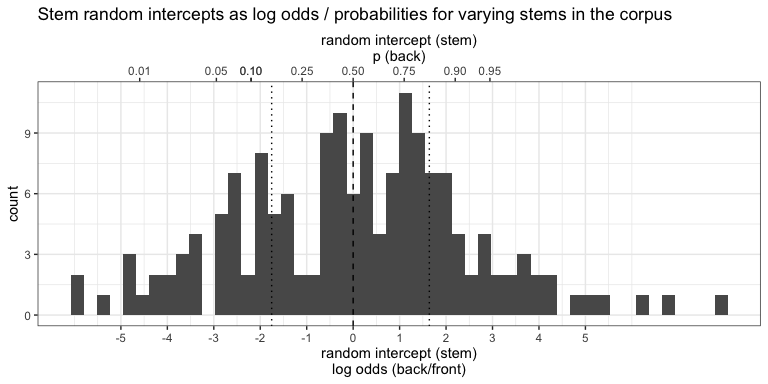
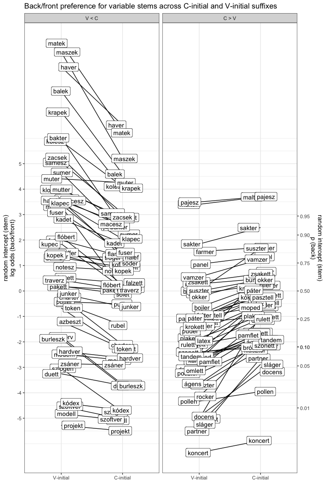
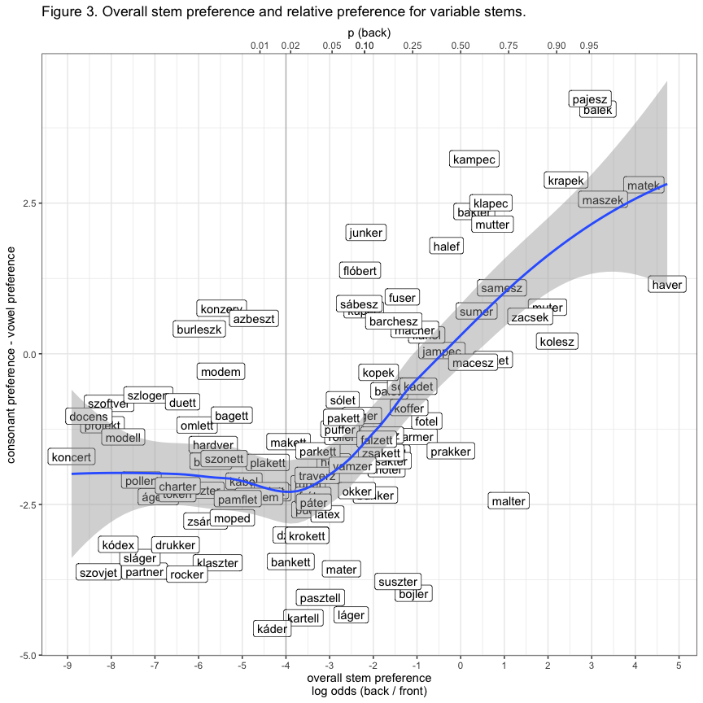
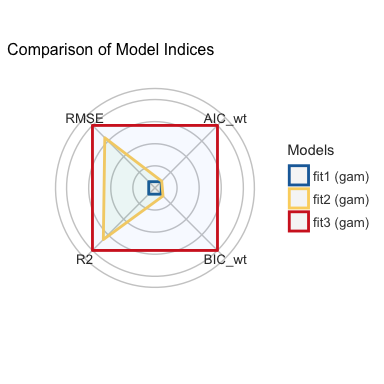
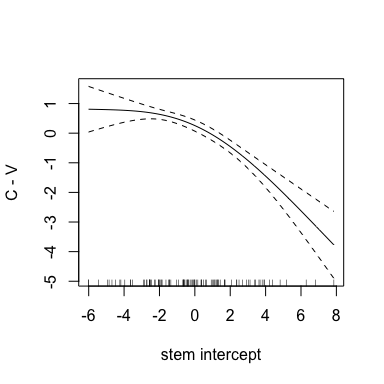
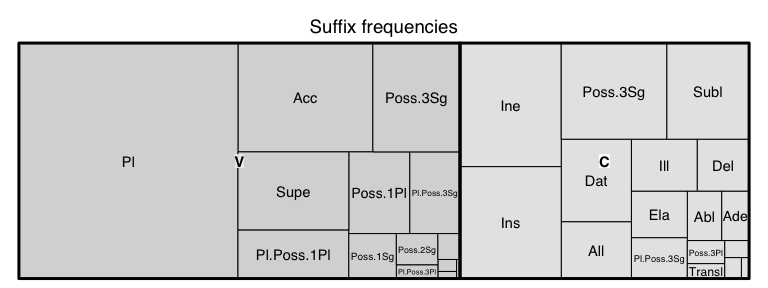
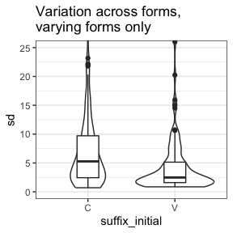
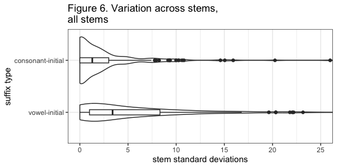

The linking vowel should be lexically specified: Evidence from Hungarian
================
Rácz, Péter & Rebrus, Péter
2024-01-27

## Notes

This readme uses Hungarian orthography. Hungarian is largely phonemic,
uses accents for vowel frontedness and length and digraphs for some
consonants. Notable differences: \<a\> (\[ɒ\]), \<e\> (\[ɛ\]), \<á\>
(\[aː\]), \<é\> (\[eː\]), \<í\> (\[iː\]), \<ó\> (\[oː\]), \<ö\> (\[ø\]),
\<ő\> (\[øː\]), \<ú\> (\[uː\]), \<ü\> (\[y\]), \<ű\> (\[yː\]), \<cs\>
(\[tʃ\]), \<dz\> (\[dz\]), \<dzs\> (\[dʒ\]), \<gy\> (\[ɟ\]), \<ly\>
(\[j\]), \<ny\> (\[ɲ\]), \<sz\> (\[s\]), \<ty\> (\[c\]), \<zs\> (\[ʒ\]).

We refer to the suffixed postposition as “suffix” such that different
word endings are different variants of the same suffix. We refer to the
unsuffixed stem and the lemma as “stem”. We refer to the suffixed stem
as “form”.

## Background

Hungarian shows vowel harmony. Noun suffixes typically have back- and
front-vowel variants which are selected to agree with the last vowel of
the stem: *Rómában* (Rome-ine), *Berlinnek* (Berlin-dat).

Historically, \<eéií\> are transparent and skipped by vowel harmony:
*Tallinban* (Tallin-loc), *Maléban* (Malé-ine). \<e\> has become
variable, meaning that back vowel + \<e\> stems vary between back and
front suffixes: *Tangernak* / *Tangernek* (Tanger-dat).

Suffixes can be vowel-initial, like the plural, or consonant-initial,
like the dative: *Párizs-ok* (Paris-pl), *London-nak* (London-dat).

## Research questions

Our focus is the back-front variation in back vowel + \<e\> stems. We
have the following questions:

1.  Is variation sensitive to the stem?
2.  Is variation sensitive to the suffix?
3.  How should variation be lexically specified?

In order to address these questions, we compiled a dataset of variable
Hungarian back vowel + \<e\> noun stems.

## Methods

We compiled a frequency list from the Hungarian Webcorpus 2 (Nemeskey
2020). The Webcorpus contains 1.8e+07 types and 8e+09 tokens. We
filtered the frequency list to include noun forms of two syllables with
a back vowel + \<e\>. We used a spellchecker (Ooms 2022) and
hand-filtering to winnow the list. We picked the 30 most common
postpositions (noun suffixes) that co-occur with these nouns. The
resulting list has 200 stems and 4501 suffixed forms. All stems are
consonant-final.

A sample of the data for the stem *dzsungel* (jungle) can be seen below:

| suffix   | form        |  freq | examples              |
|:---------|:------------|------:|:----------------------|
| Pl       | dzsungelek  |  1010 | haverok, projektek    |
| Pl       | dzsungelok  |     1 | haverok, projektek    |
| Ine      | dzsungelben | 10604 | panelban, projektben  |
| Ine      | dzsungelban |   258 | panelban, projektben  |
| Ins      | dzsungellel |   528 | haverral, szoftverrel |
| Ins      | dzsungellal |    12 | haverral, szoftverrel |
| Poss.3Sg | dzsungele   |   509 | samesza, partnere     |
| Poss.3Sg | dzsungelje  |    19 | haverja, modellje     |
| Supe     | dzsungelen  |  1037 | panelon, koncerten    |
| Supe     | dzsungelon  |     3 | panelon, koncerten    |
| Subl     | dzsungelre  |   275 | panelra, koncertre    |
| Subl     | dzsungelra  |    14 | panelra, koncertre    |
| Dat      | dzsungelnek |   701 | havernak, projektnek  |
| Dat      | dzsungelnak |    21 | havernak, projektnek  |
| Poss.1Pl | dzsungelünk |    39 | haverunk, partnerünk  |
| All      | dzsungelhez |   146 | matekhoz, projekthez  |
| All      | dzsungelhoz |     2 | matekhoz, projekthez  |

Sample long data for “dzsungel”

Note that the stem shows back / front variation with most suffix tags
(such as the inessive: *dzsungelben* n = 10604, *dzsungelban* n = 258,
“in the jungle”) but not all of them. For example, no back variant of
the Poss.1Pl is attested (*dzsungelünk* n = 39, *dzsungelunk* n = 0,
“our jungle”).

We restricted the data to suffixed forms that do show back / front
variation in the corpus, resulting in 161 stems and 1231 suffixed forms.
We went on to calculate the log odds ratio of back and front forms for
each suffixed form. A sample of the resulting data for “dzsungel” can be
seen below:

| suffix | back | front | log_odds_back |
|:-------|-----:|------:|--------------:|
| Pl     |    1 |  1010 |         -6.92 |
| Ine    |  258 | 10604 |         -3.72 |
| Ins    |   12 |   528 |         -3.78 |
| Supe   |    3 |  1037 |         -5.85 |
| Subl   |   14 |   275 |         -2.98 |
| Dat    |   21 |   701 |         -3.51 |
| All    |    2 |   146 |         -4.29 |
| Ill    |  136 |  3050 |         -3.11 |
| Del    |    9 |   103 |         -2.44 |
| Ela    |   41 |   896 |         -3.08 |

Sample wide data for “dzsungel”

We wanted to gauge the extent of variation for each stem. We could sum
counts across back and front suffixes for each form. This would not
provide an accurate picture of variation. This is because the suffixes
(or “analyses”) themselves vary in both raw frequency and the ratio of
back and front forms. Instead, following Janda, Nesset & Baayen (2010),
we fit a Generalised Linear Mixed Model (Bates 2015) predicting the
proportion of back / front forms, estimating only an overall intercept
as well as a random intercept (grouping factor) for each stem and each
suffix type (`cbind(back,front) ~ 1 + (1|stem) + (1|suffix)`). We then
extracted the stem intercept and used this instead of the log odds of
total counts per stem. We did this across all 1231 varying suffixed
forms, as well as only for forms with consonant-initial or vowel-initial
suffixes, respectively. As a result, we have three numbers per stem to
express how these vary

1.  in total,
2.  with consonant-initial suffixes,
3.  with vowel-initial suffixes.

If we sum the counts of back and front suffixed forms for each stem and
take the log odds, the resulting raw log odds will be fairly close to
the intercepts. The intercepts, however, take an extra step: they
incorporate variation across suffixe types as well.

We also fit a set of simpler models that ignore variation across
suffixes (`cbind(back,front) ~ 1 + (1|stem)`).

## Results

The random intercepts tells us how much a stem prefers back or front
suffixes overall.

Since the intercept values come from models predicting log odds, these
themselves can be very roughly interpreted as expressing log odds
ratios. They reveal that, even in the set of stems that show back /
front variation, some stems have an extreme preference for back or front
suffixes. This can be seen in the figure below:

<!-- -->

50% of the stems are either below p = 0.15 or above p = 0.84.

### 1. Is variation tied to the stem?

We wanted to know whether form-based similarity drives variation across
stems. That is, if two stems look similar to one another, will they have
a similar preference for back/front suffixes?

We split the stems in two categories: “back” if the stem intercept was
above 0 and “front” if it was equal to or below 0. We went on to take
all varying stems, transcribe them using a simple segment-to-character
script, calculated Levenshtein distances between every stem, and then
used the resulting distance matrix to fit a very simple K-nearest
neighbours model. The model takes each stem as a target, identifies all
other stems with the smallest Levenshtein distance to the target, and
then makes a category prediction for the target based on the majority
label in this filtered training set of nearest neighbours.

We used our simple nearest neighbours model to see whether form-based
similarity predicts stem behaviour. Recall that we split the stems into
two discrete categories, “back” (above 0 in the figure above) and
“front” (below zero in the figure above). We then used the closest stems
for each stem (excluding the stem itself) to predict what category the
stem should be in. If this simple method can predict stem behaviour with
an accuracy that is above chance, that strongly suggests that stems that
look a certain way behave a certain way.

Model predictions are significantly correlated with category labels
(Chisq = 21.19, p \> 0.0001). This means that stem-level variation is
not arbitrary – it is predicted by the shape of the stem.

One explanation for this stem-level specification of variation is
diachronic (Forró 2013). Back vowel + \<e\> nouns that entered the
language primarily in writing are much more likely to prefer
front-suffixes, while those that were borrowed in the spoken register
prefer back-suffixes. This can be illustrated by a sample of the stems
that show strongest back- versus front-preference.

| stem     | intercept |     p |
|:---------|----------:|------:|
| koncert  |    -6.009 | 0.002 |
| docens   |    -5.998 | 0.002 |
| projekt  |    -5.433 | 0.004 |
| modell   |    -4.944 | 0.007 |
| szoftver |    -4.848 | 0.008 |
| krapek   |     4.820 | 0.992 |
| balek    |     5.194 | 0.994 |
| fater    |     5.400 | 0.996 |
| maszek   |     6.293 | 0.998 |
| matek    |     6.830 | 0.999 |
| haver    |     7.858 | 1.000 |

Top five and bottom five variable stems in the corpus

The top 5 forms (with a very low intercept, that is, a very strong
preference for front forms) are all learned borrowings (koncert, docens,
projekt, modell, szoftver). In contrast, the five bottom forms are all
informal (balek, fater, maszek, matek, haver): these are either
borrowings with a considerable semantic shift (“balek”, meaning
“gullible idiot”, comes from Turkish “balık”, “fish”, “haver”, meaning
“pal”, comes from Hebrew “חבר”, “friend”, “fater”, meaning “daddy”,
comes from German “Vater”, meaning “father”).

### 2. Is variation tied to the suffix?

If back/front variation hinged only on the stem, we would expect that a
suffix random intercept does not improve model fit (that is,
`cbind(back,front) ~ stem + suffix` is not a better fit than
`cbind(back,front) ~ stem`). We can use a likelihood test to compare
these two models:

    ## # Likelihood-Ratio-Test (LRT) for Model Comparison
    ## 
    ## model         | df |     Chi2 |      p
    ## --------------------------------------
    ## stem + suffix |  3 |          |       
    ## stem only     |  2 | 23675.34 | < .001

This shows that suffixes are responsible for at least some of the
variation. We can get closer to how this works by comparing the
behaviour of consonant-initial and vowel-initial suffixes.

Stem-based variation shows an apparent asymmetry across
consonant-initial versus vowel-initial suffixes. This can be seen in the
table below, which shows a subset of suffixed forms for the mostly
back-preferring stem *haver* and the mostly front stem *koncert*.

| stem    | form         | suffix      | suffix_vowel | suffix_initial |  freq |
|:--------|:-------------|:------------|:-------------|:---------------|------:|
| haver   | haverról     | Del         | back         | C              |    62 |
| haver   | haverről     | Del         | front        | C              |    15 |
| haver   | haverjaink   | Pl.Poss.1Pl | back         | C              |   235 |
| haver   | haverjeink   | Pl.Poss.1Pl | front        | C              |     1 |
| haver   | haverjaim    | Pl.Poss.1Sg | back         | C              |  2007 |
| haver   | haverjaik    | Pl.Poss.3Pl | back         | C              |   646 |
| haver   | haverjai     | Pl.Poss.3Sg | back         | C              |  4757 |
| haver   | haverjei     | Pl.Poss.3Sg | front        | C              |     4 |
| haver   | haverjuk     | Poss.3Pl    | back         | C              |   467 |
| haver   | haverjük     | Poss.3Pl    | front        | C              |     4 |
| haver   | haverra      | Subl        | back         | C              |   214 |
| haver   | haverre      | Subl        | front        | C              |     5 |
| haver   | haverok      | Pl          | back         | V              | 20730 |
| haver   | haverek      | Pl          | front        | V              |   140 |
| haver   | havereink    | Pl.Poss.1Pl | front        | V              |     2 |
| haver   | havereim     | Pl.Poss.1Sg | front        | V              |     9 |
| haver   | haveraim     | Pl.Poss.1Sg | back         | V              |     2 |
| haver   | haverei      | Pl.Poss.3Sg | front        | V              |    12 |
| haver   | haverai      | Pl.Poss.3Sg | back         | V              |     2 |
| haver   | haverunk     | Poss.1Pl    | back         | V              |  1031 |
| haver   | haverünk     | Poss.1Pl    | front        | V              |    13 |
| haver   | haverotok    | Poss.2Pl    | back         | V              |   127 |
| haver   | haverük      | Poss.3Pl    | front        | V              |     2 |
| haver   | haveruk      | Poss.3Pl    | back         | V              |     1 |
| haver   | haveron      | Supe        | back         | V              |    51 |
| haver   | haveren      | Supe        | front        | V              |     1 |
| koncert | koncertről   | Del         | front        | C              | 12315 |
| koncert | koncertról   | Del         | back         | C              |     4 |
| koncert | koncertjeink | Pl.Poss.1Pl | front        | C              |  1605 |
| koncert | koncertjeim  | Pl.Poss.1Sg | front        | C              |   349 |
| koncert | koncertjeik  | Pl.Poss.3Pl | front        | C              |  2638 |
| koncert | koncertjei   | Pl.Poss.3Sg | front        | C              |  9959 |
| koncert | koncertjük   | Poss.3Pl    | front        | C              |  7556 |
| koncert | koncertjuk   | Poss.3Pl    | back         | C              |    15 |
| koncert | koncertre    | Subl        | front        | C              | 50442 |
| koncert | koncertra    | Subl        | back         | C              |    18 |
| koncert | koncertek    | Pl          | front        | V              | 94772 |
| koncert | koncerteink  | Pl.Poss.1Pl | front        | V              |     5 |
| koncert | koncerteim   | Pl.Poss.1Sg | front        | V              |     1 |
| koncert | koncertei    | Pl.Poss.3Sg | front        | V              |    11 |
| koncert | koncertünk   | Poss.1Pl    | front        | V              |  5800 |
| koncert | koncertunk   | Poss.1Pl    | back         | V              |    10 |
| koncert | koncertetek  | Poss.2Pl    | front        | V              |   583 |
| koncert | koncertük    | Poss.3Pl    | front        | V              |    34 |
| koncert | koncerten    | Supe        | front        | V              | 86590 |
| koncert | koncerton    | Supe        | back         | V              |     4 |

Delative, plural, sublative, and superlative suffixed forms for “haver”
and “koncert”

When we look at *haver*, we see that it overwhelmingly prefers back
suffixes (as expected). In addition, this is even more marked with
V-initial versus C-initial suffixes. For instance, the back-front ratio
for the C-initial delative (*haverr\[óő\]l*) is 62/15. In contrast, for
the V-initial superessive (*haver\[oe\]n*), it is 51/1. The behaviour of
*koncert*, which has an overall front preference with the C-initial
suffixes, has a front / back ratio of 86590 / 4 for the superessive
(*koncert\[oe\]n*), and is not attested in the corpus with a back vowel
in the delative (*koncertről*) and the plural (*koncertek*) at all.

Even if we keep our focus on the set of stems that do vary with at least
one C-initial and one V-initial suffix, this overall trend is visible.
This can be seen in the figure below:

<!-- -->

The figure is split into two panels for the sake of legibility. The left
panel shows stems that show a stronger back-preference with V-initial
versus C-initial suffixes, the right panel, the other way round. In each
panel, the two columns show the V-initial and the C-initial random
intercept for the stem. Each line expresses the ratio of back preference
with V- versus C-initial suffixes. For “haver”, seen on top in the left,
this is very much a positive relationship. For “koncert”, seen at the
bottom in the right, this is a weaker negative relationship.

What we see is an interactive, rather than additive, relationship
between stem-level and suffix-level variation. If the stem prefers back
suffixes, this is more pronounced with vowel-initial suffixes. If it
prefers front suffixes, this, in turn, is more pronounced with
vowel-initial suffixes.

We can express this relationship in two steps. First, we can subtract
the V-initial intercept from the C-initial intercept to express the
ratio of the two. This will be a larger, negative value for *haver*
(where the C intercept is smaller than the V intercept) and a smaller,
positive value for *koncert* (where the C intercept is larger than the V
intercept). We can then plot this value against the overall stem
preference for back / front suffixes. The resulting figure can be seen
below:

<!-- -->

We find a non-linear relationship. Stems that show a strong preference
for front suffixed forms (the *koncert* category) show this about
equally with C- and V-initial suffixes. Stems that show a strong
preference for back suffixed forms (the *haver* category) show an
exacerbated preference with V-initial suffixes.

We can test this relationship by fitting three generalised additive
models (Wood 2011), predicting C-V preference from overall preference
across variable stems, using Maximum Likelihood, estimating

1.  an intercept only,
2.  a linear relationship,
3.  a smooth (k = 3),

and seeing which model provides the best fit. The best model, as seen in
Figure below, is (3).

<!-- -->

The predicted relationship can be seen in the figure below:

<!-- -->

This shows that stem-level preference has a significant relationship
with the change between V- and C-preference across variable stems. That
is, V-initial suffixes magnify the pre-existing pattern.

## 3. How should variation be lexically specified?

Why do we see a C/V asymmetry? What lexical patterns does it represent?
In order to answer this question, we have to first look at the
distribution of C- and V-initial suffixes. Overall, there is roughly the
same amount of C- and V-initial suffix types in our dataset. Their
frequency distribution is very different: the two most frequent suffixes
are the plural and the accusative, and these happen to be both
V-initial. The plural in itself is about 30% of all forms and 50% of all
forms with a V-initial suffix. This can be seen in the figure below:

<!-- -->

This means that stems vary more across C-initial suffixes. For any given
stem, the vast majority of back / front variation in V-initial suffixes
will likely come from the plural. For C-initial suffixes, this will be
more evened out.

We can sum the back and front form counts for each stem across C- and
V-initial suffixes. We can then calculate the standard deviation of the
back / front ratio for each stem across suffix type. This will result in
two standard deviation values per stem: across C-initial and acros
V-initial suffixes.

We can plot the distribution of standard deviations for C-initial and
V-initial suffixes across stems and suffixes that do show variation. The
figure can be seen below:

<!-- -->

C-initial forms are more variable. This is especially so if we include
all stems and all suffixes in the dataset, including those that do not
show variation:

<!-- -->

The difference is significant in either case (varying forms: t = 3.63,
95%CI \[\`1.1;6.17\], all forms: t = 4.02, 95%CI \[2.1;5.94\], using a
two-sided t test.) (This has been revealed to me in a dream
(2024-01-26).)

Once we acknowledge this asymmetry, we need to lexically specify the
linking vowel. The end.
