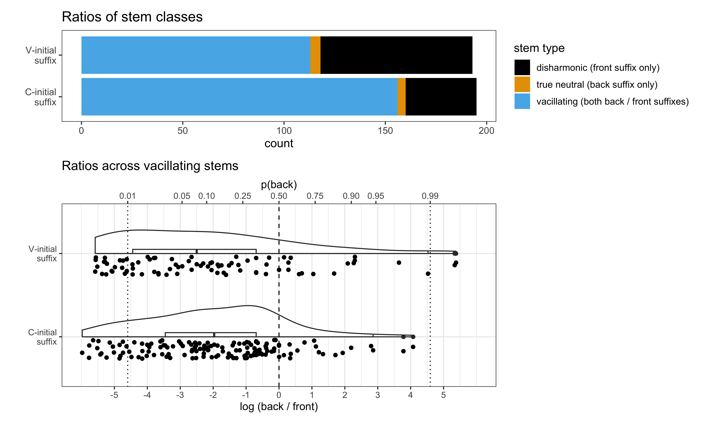
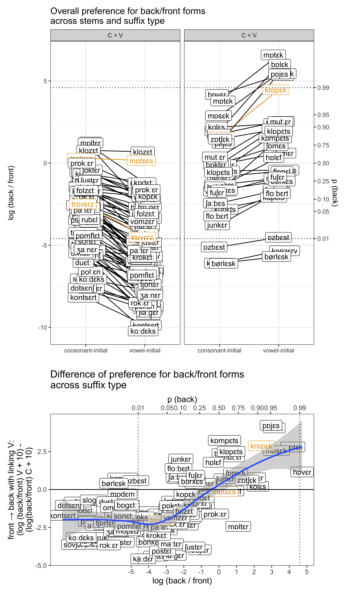
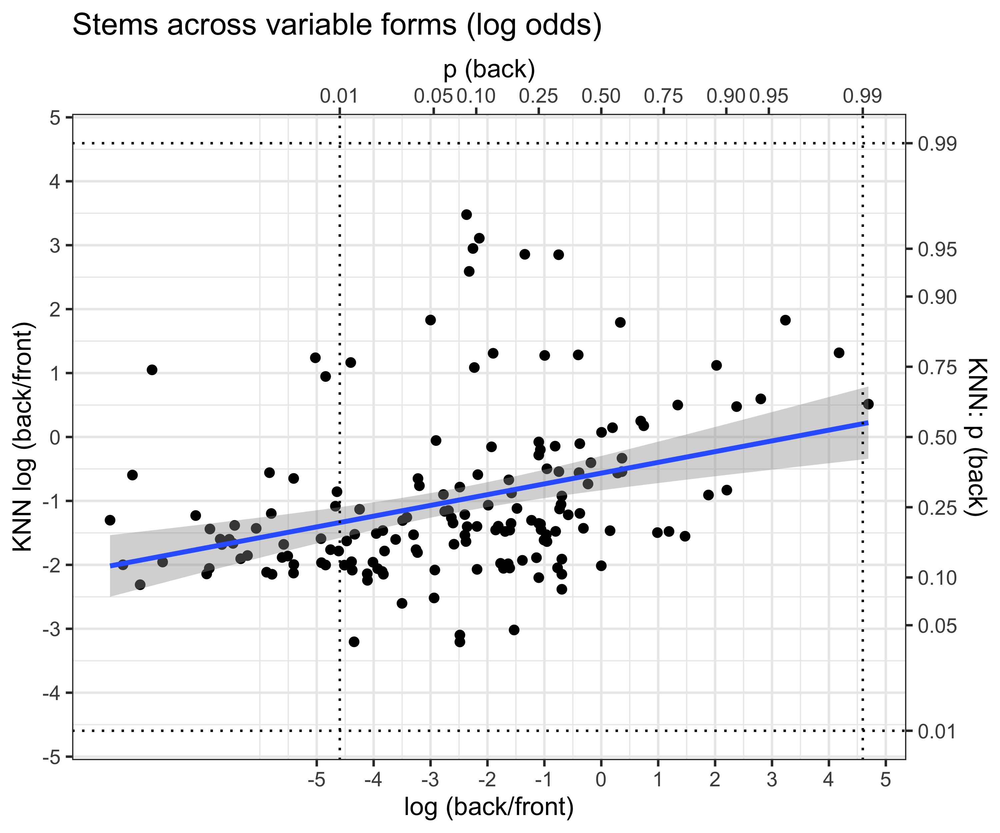
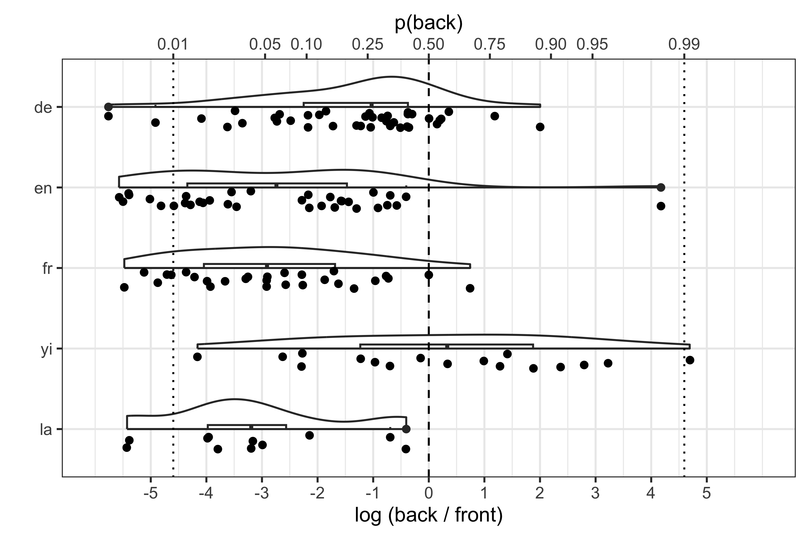

SI. Lexical patterns in Hungarian derivational morphology
================
Rácz, Péter & Rebrus, Péter
2024-06-11

## Research Questions

We have two research questions:

1.  How much can we predict back/front variation based on the stem
    alone?
2.  Can we improve on our predictions if we also include the suffixes?

In order to address these questions, we compiled a dataset of variable
Hungarian back vowel + \<e\> noun stems and built a K Nearest-Neighbour
model to categorise them using stem similarity. We then went on to add
suffix-evel information to the model to see if this improved its
accuracy.

## Dataset

We compiled a frequency list from the Hungarian Webcorpus 2 ([Nemeskey
2020](https://hlt.bme.hu/en/resources/webcorpus2)). The Webcorpus
contains 1.8e+07 types and 8e+09 tokens. We filtered the frequency list
to include noun forms of two syllables with a back vowel + \<e\>. We
used a spellchecker (Ooms 2022) and hand-filtering to winnow the list.
We picked the 30 most common suffix types that co-occur with these
nouns. The resulting list has 200 stems and 4501 suffixed forms. All
stems are consonant-final.

A sample of the data for the stem *fotel* (armchair) can be seen in
Table 1.

| suffix   | form     | freq | suffix examples                |
|:---------|:---------|-----:|:-------------------------------|
| Pl       | fotelek  | 5282 | haverok, projektek             |
| Pl       | fotelok  |  754 | haverok, projektek             |
| Acc      | fotelet  |    1 | flóbertot, flóbertet/flőbörtöt |
| Ine      | fotelben | 8185 | panelban, projektben           |
| Ine      | fotelban | 4069 | panelban, projektben           |
| Ins      | fotellel |  807 | haverral, szoftverrel          |
| Ins      | fotellal |  274 | haverral, szoftverrel          |
| Poss.3Sg | fotelje  |  276 | haverja, modellje              |
| Poss.3Sg | fotelja  |  258 | haverja, modellje              |
| Poss.3Sg | fotele   |   96 | samesza, partnere              |
| Supe     | fotelen  |  263 | panelon, koncerten             |
| Supe     | fotelon  |  202 | panelon, koncerten             |
| Subl     | fotelre  |  505 | panelra, koncertre             |
| Subl     | fotelra  |  242 | panelra, koncertre             |
| Dat      | fotelnek |  363 | havernak, projektnek           |
| Dat      | fotelnak |   75 | havernak, projektnek           |
| Poss.1Pl | fotelünk |  234 | haverunk, partnerünk           |

Table 1: Sample long data for *dzsungel*

We restricted the data to suffixed forms that do show back / front
variation in the corpus, resulting in 164 stems and 2462 suffixed forms.
We went on to calculate the log odds ratio of back and front forms for
each suffixed form (`log( back / front )`), resulting in 1231 suffixed
pairs across 161 stems. The difference here arises because 3 stems do
vary but only across, not within suffixes.

A sample of the resulting data for *fotel* can be seen in Table 2.

| suffix      | back | front | log_odds_back |
|:------------|-----:|------:|--------------:|
| Poss.2Pl    |    9 |     6 |          0.41 |
| Ill         | 3232 |  3212 |          0.01 |
| Poss.3Sg    |  258 |   276 |         -0.07 |
| Supe        |  202 |   263 |         -0.26 |
| Poss.1Sg    |   90 |   143 |         -0.46 |
| Pl.Poss.1Sg |    1 |     2 |         -0.69 |
| Ine         | 4069 |  8185 |         -0.70 |
| Subl        |  242 |   505 |         -0.74 |
| Ela         | 2056 |  4503 |         -0.78 |
| Abl         |   27 |    68 |         -0.92 |

Table 2. Sample wide data for *fotel*

We sum front / back counts across stems and calculate log odds. An
alternative would be to take into account the hierarchy in the data and
estimate a random intercept for stems using a hierarchical binomial
model following Janda, Nesset, and Baayen (2010). The correlation
between the random intercepts and the raw log odds is 0.99.

## K Nearest-Neighbours Model

We took the 164 varying stems and transcribed them using a simplified
phonetic transcription. This transcription replaced letter digraphs with
single characters (*szatyor* “bag” -\> \<saṯor\>). We calculated the log
odds of back / front forms for each stem by grouping the data across
stems and summing back and front counts across suffixes. We split the
stems into five frequency quantiles.

Our K-Nearest Neighbour learner was written in R. It matched a target
word to test words and predicted its behaviour based on the behaviour of
its nearest neighbours. It calculated the Levenshtein distance between
the transcribed test word and transcribed target words, arranged target
words from smallest to largest distance from the test word, and selected
the first k target words. Some target words might have the same
Levenshtein distance from the test word (e.g. the Levenshtein distance
between *hotel*, *motel*, and *fotel* “armchair” is 1), so the order of
target words within distance brackets was randomised. The learner then
summed over the back and front form counts for the k nearest neighbours
and calculated a total log odds. The learner returned this value as the
prediction for the test form. The learner used a leave-one-out fitting
method, comparing test forms to all training forms except the test form
itself.

An example with `k = 3` and the target word *fotel* can be seen in Table
3. The first columns shows the test word. The second column shows the
five closest neighbours to *fotel*: *hotel, motel, totem, notesz,
fater*. The summed back and front counts for each form are in the next
two columns (viz. there are, in total, 7722 back variants and 140832
front variants of *hotel* in the dataset). Given `k = 3`, we sum over
back and front forms for the first three and log the odds, which is
`log(7722+623+3=8348/140832+3386+142=144360) = -2.58` (or p = .07). This
is the predicted value for *fotel*. The true value is -.76 (p = .32), so
the learner is not particularly accurate in this example.

| test  | target | transcription | back |  front | distance |   k | sum back | sum front |  pred |
|:------|:-------|:--------------|-----:|-------:|---------:|----:|---------:|----------:|------:|
| fotel | hotel  | hotel         | 7722 | 140832 |        1 |   1 |          |           |       |
|       | motel  | motel         |  623 |   3386 |        1 |   2 |          |           |       |
|       | totem  | totem         |    3 |    142 |        2 |   3 |     8348 |    144360 | -2.58 |
|       | notesz | notes         |  628 |   3686 |        2 |   4 |          |           |       |
|       | fater  | fater         | 3133 |    190 |        2 |   5 |          |           |       |

Table 3. Example KNN for *fotel*.

Our learner differs from KNN learner used in categorisation problems and
machine learning. A more typical KNN learner provides a category label,
not a category weight. In addition, a more typical KNN learner will not
involve a random component, since distances in any given category space
are likely more fine-grained and so unique for every target item in the
training set. (Think of an RGB scale on which every unit of change in
R/G/B from a reference colour will define a distinct colour, however
small the difference is.)

Our learner had two parameters, `k`, the number of nearest neighbours
(possible values: 1,7,10,12,15), and `f`, the relative frequency of
stems in the training set (possible values: 1-5, where the training set
consists of forms in the f+ quantiles of the total training set).

For each parameter setting, we fit a binomial generalised linear model
predicting the back/front ratio for each stem from the KNN prediction
for that stem across all 164 stems. We used the linear model’s z-value
to select the best model. Since models only differed from one another by
the KNN parameter settings, this gave us the best KNN parameter
settings: `k = 7` and `f = 3`. This means that the best learner compared
the target form to its first seven nearest neighbours. The best learner
operated on the top 40% of the log odds distribution of training forms,
ignoring the less frequent training forms.

## Combined model

In order to incorporate suffix-specific information on some level, we
marked whether a suffix was consonant- or vowel-initial in our paired
dataset. That is, whether the suffix involved a linking vowel. We then
went on to build generalised linear mixed models that used stem-level
information, KNN predictions, and suffix-level information, presence of
a linking vowel, to predict the log odds of variable forms in the data.

We built four models, shown in Table 4. We used AIC, BIC, and a
likelihood ratio test of model fit to find the best random effect
structure for each model and to find the best model.

| formula                                                                  |      AIC |      BIC | R2_conditional | R2_marginal | RMSE |    Chi2 |   p |
|:-------------------------------------------------------------------------|---------:|---------:|---------------:|------------:|-----:|--------:|----:|
| 1 + (1 \| stem) + (1 \| suffix)                                          | 21115.72 | 21131.07 |           0.68 |        0.00 | 0.15 |         |     |
| 1 + knn + (1 \| stem) + (1 \| suffix)                                    | 21095.15 | 21115.62 |           0.68 |        0.08 | 0.15 |   22.57 |   0 |
| 1 + knn + suffix_initial + (1 + suffix_initial \| stem) + (1 \| suffix)  | 16574.85 | 16610.66 |           0.69 |        0.07 | 0.14 | 4526.31 |   0 |
| 1 + knn \* suffix_initial + (1 + suffix_initial \| stem) + (1 \| suffix) | 16563.04 | 16603.96 |           0.70 |        0.11 | 0.14 |   13.81 |   0 |

Table 4. Models of the variable back + e pairs.

We go through the models one by one.

- Model 1 is our reference model. It groups data across stem and suffix.
- Model 2 includes the stem-level predictions of the best KNN learner.
  AIC and BIC show that learner predictions improve model fit over the
  null model.
- Model 3 adds suffix-level information to the formula, viz. whether the
  suffix is consonant- or vowel-initial.
- Model 4 tests the interaction of suffix-initial vowel and stem-level
  learner prediction. This model provides **the best fit** of the data.

## Hayes Check

If the stem ends in one of the categories from Hayes et al 2009, do we
see the same pattern in our corpus data as they saw in their data
(preference for front variants)? Yes. The paper argues that a stem is
more likely to select a front vowel suffix if it ends in a labial stop,
a sibilant, a coronal sonorant, or a consonant cluster. 142/164 stems
match one of these categories in our data. We fit a generalised linear
model predicting the log odds of back suffixes if the stem matched any
of the categories. We found that these stems are less likely to select a
back suffix (est = -2, 95%CI: \[-2.02;-1.99\]).

## Visualisations

### Figure 1

<!-- -->

### Figure 2

<!-- -->

### Figure 3

<!-- -->

### Figure 4

<!-- -->

### Figure 5

<!-- -->

### Figure 6

<!-- -->
