> "ma éjjel vedeljük a pezsgőt, egymáshoz simulunk ketten, ketten a parketten" (pajor tamás)

---

- `[back]+e` főnevek vacillálnak `[front]` és `[back]` toldalékok között
- familiáris szavak: főleg `[back]` toldalékok. *haverok/haverek, barterban/barterben, alteros/?alteres*
- művelt szavak: *[front]* toldalékok: *partnerem/partnerom, parketten/?parketton, modellek/?modellok*

---

Ha egy kétszótagos, vegyes hangrendű, `e`-s főnév szereti a hátulképzett toldalékokat, akkor a magánhangzóval kezdődő toldalékok esetében ez a preferencia erősebb, mint a mássalhangzóval kezdődő toldalékok esetében. Ha az elölképzett toldalékokat szereti, akkor ez a preferencia gyengébb. (Forró Orsolya)

---

példa							tő 		toldalék
---------------------------    	------ 	----------
partnerek > \*partnerok			front	V
partnernek > partnernak			front	C
havernak > havernek				back	C
haverok > \*havernek			back	V

---

- összeszedtem az összes magyar kétszótagú, vegyeshangrendű, e-s főnevet a magyar webkorpusz 2-ből (Nemeskey 2022)
- szűrtem helyesírásra, kidobáltam az összetett szavakat és a szemetet
- 235 alak: *koncert, docens, projekt, szovjet, szoftver, kódex, modell, konszern, sláger, muter, kolesz, krapek, komplex (...) pajesz, balek, maszek, fater, matek, haver*
- összeszedtem a vaciláló toldalékos alakokat

---

lemma    tag             form                          freq
-------  --------------  ----------------------  ----------
samesz   Dat       		 samesznek / samesznak      18 / 26
samesz   Plur		     sameszek / sameszok        33 / 80
sumer    Dat             sumernek / sumernak        81 / 45
sumer    Plur 	  	     sumerek / sumerok        386 / 711

---

lemma    __xpostag__         form                          freq
-------  ------------------  ----------------------  ----------
samesz   __[/N][Dat]__       samesznek / samesznak      18 / 26
samesz   __[/N][Pl][Nom]__   sameszek / sameszok        33 / 80
sumer    __[/N][Dat]__       sumernek / sumernak        81 / 45
sumer    __[/N][Pl][Nom]__   sumerek / sumerok        386 / 711

---

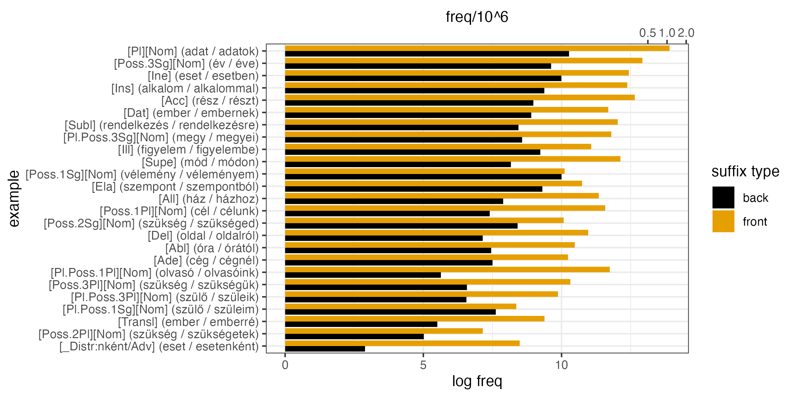{width=500}

---

__lemma__    xpostag         form                          freq
-----------  --------------  ----------------------  ----------
__samesz__   [/N][Dat]       samesznek / samesznak      18 / 26
__samesz__   [/N][Pl][Nom]   sameszek / sameszok        33 / 80
__sumer__    [/N][Dat]       sumernek / sumernak        81 / 45
__sumer__    [/N][Pl][Nom]   sumerek / sumerok        386 / 711

---

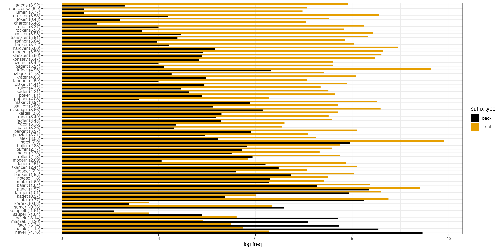{width=500}

---

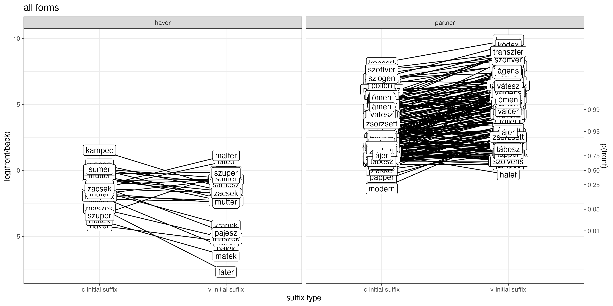{width=500}

---

{width=300}

---

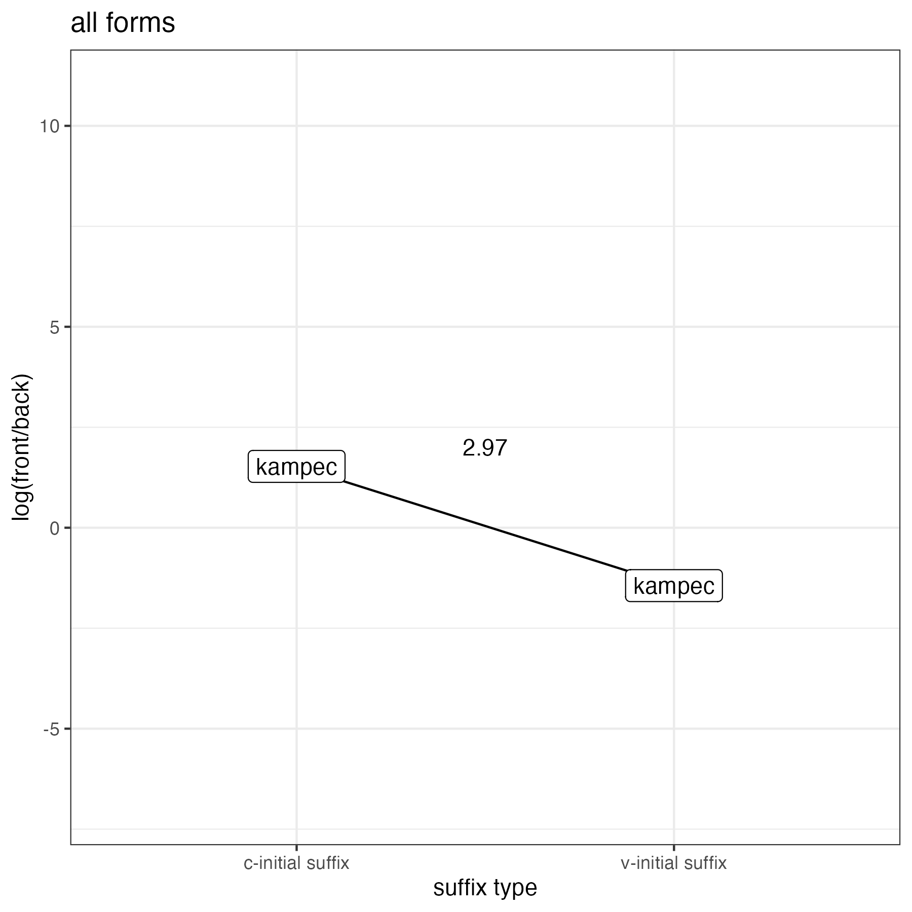{width=300}

---

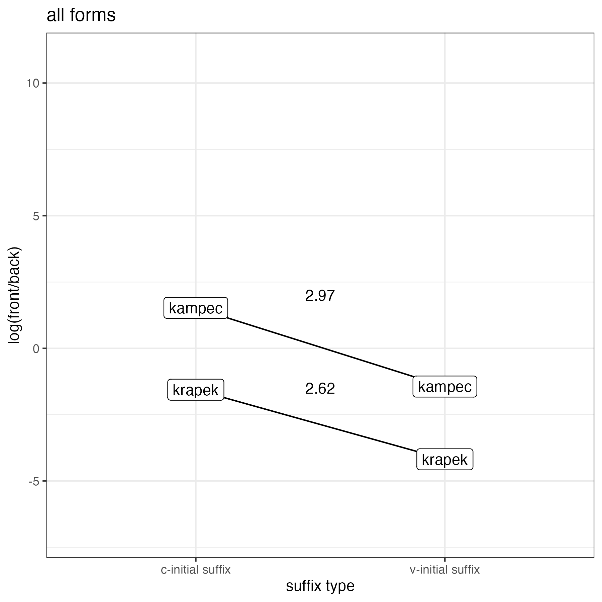{width=300}

---

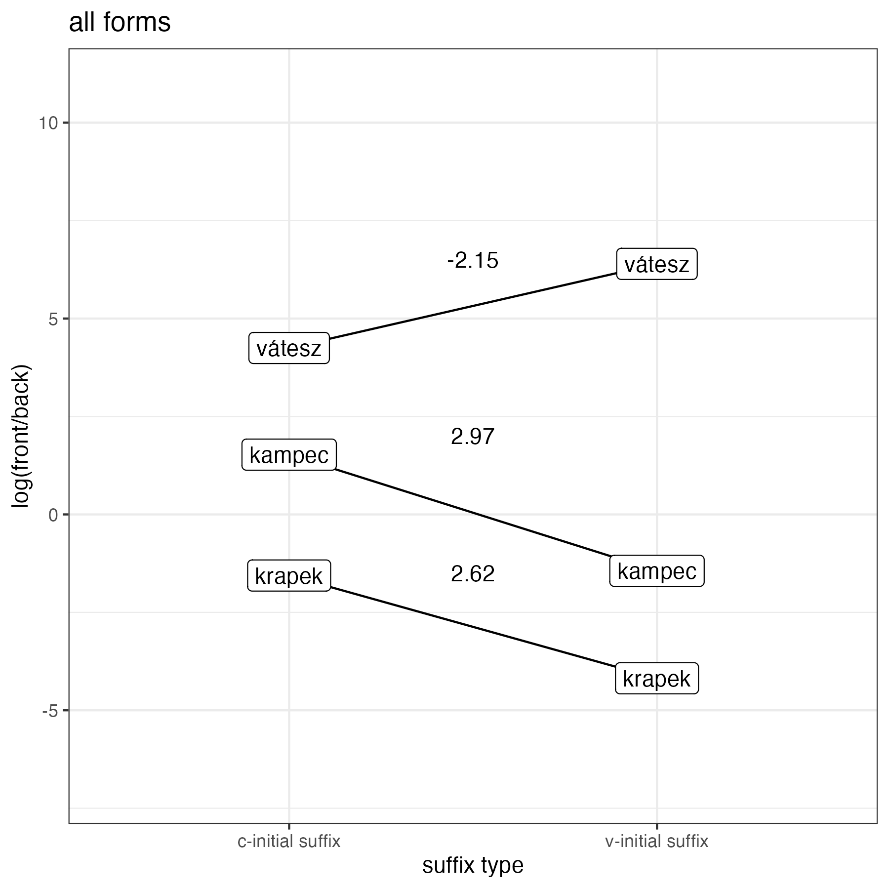{width=300}

---

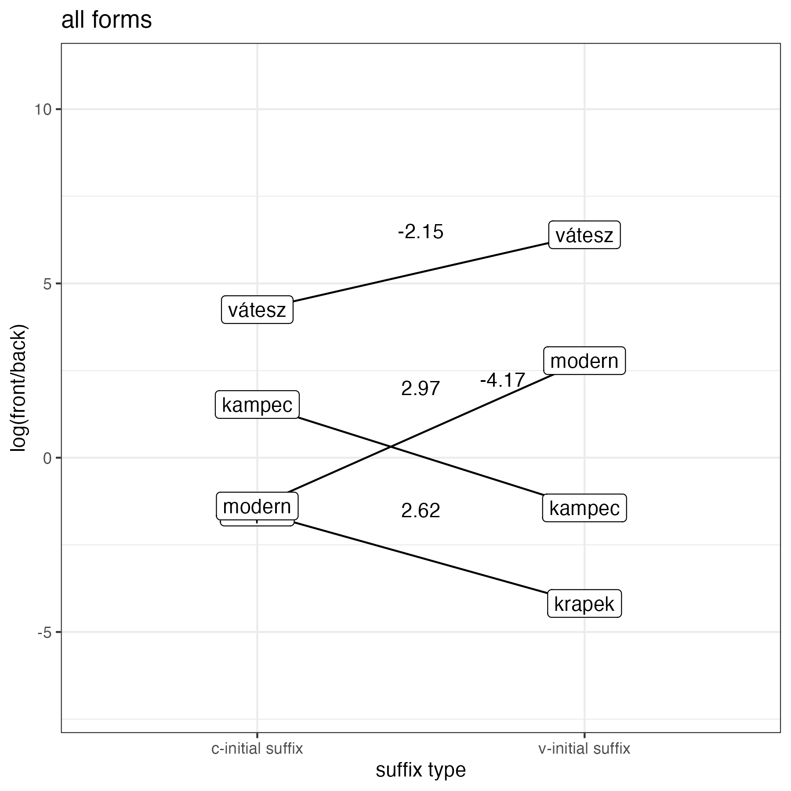{width=300}

---

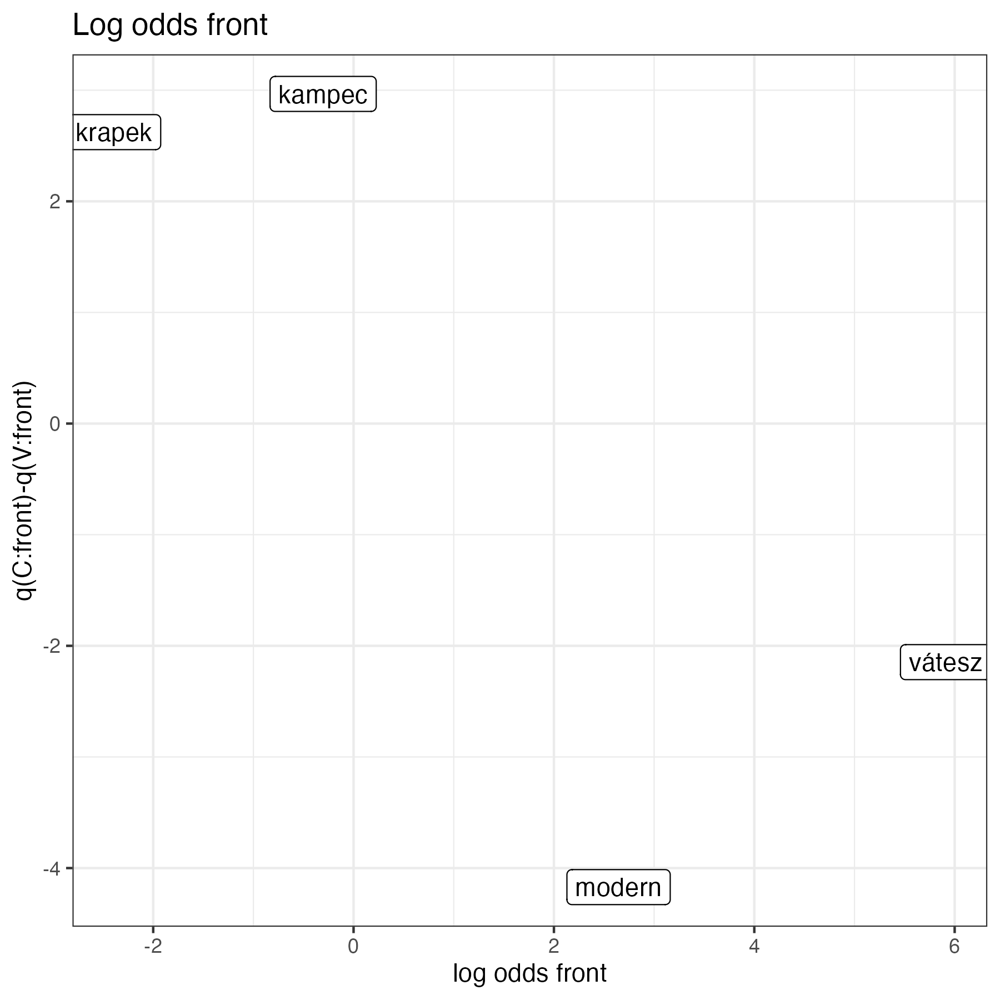{width=300}

---

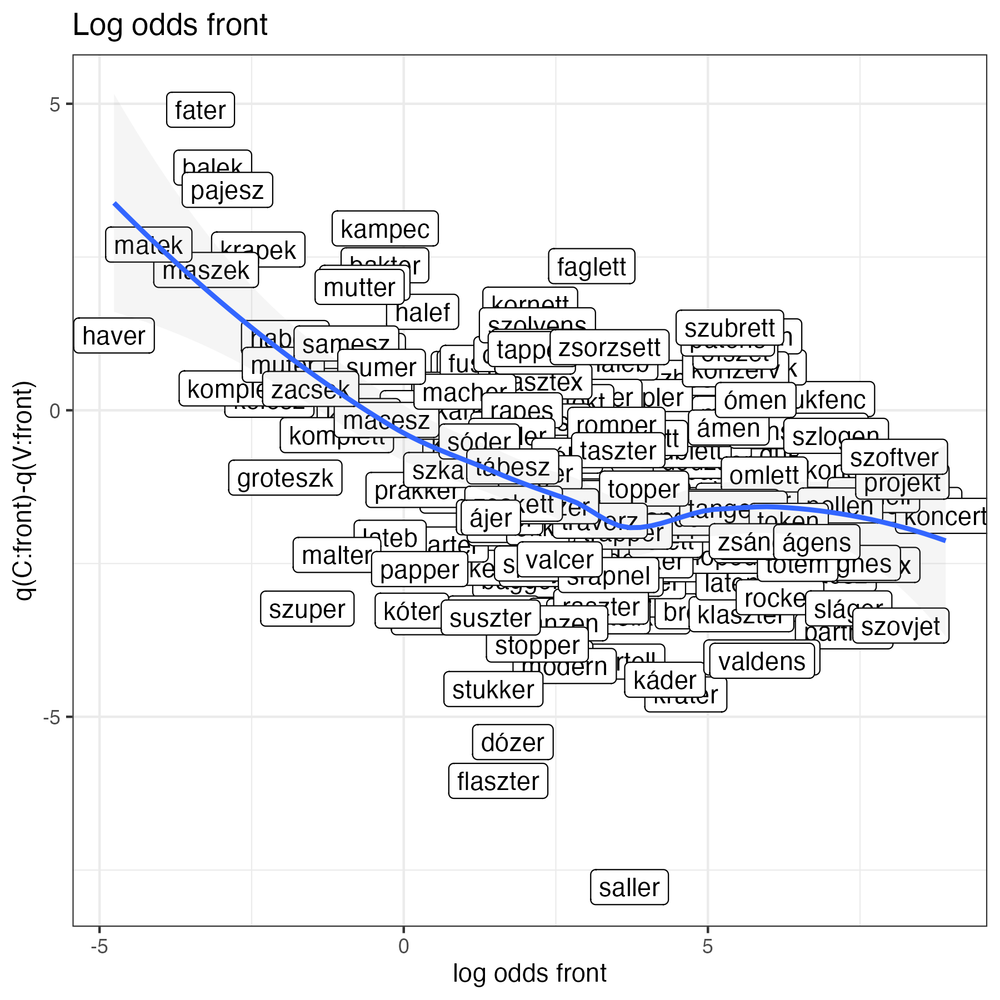{width=300}

---

## Összegoflalás

- ha egy vegyes főnév nagyon szereti a back alakokat, akkor különösen szereti őket V-kezdetű toldalékokkal
- ha szereti a front alakokat, akkor különösen szereti őket V-kezdetű toldalékokkal
- ez a viszony nem lineáris. addig marad igaz, amíg vannak rendesen back alakok
- hogyan tudjuk ezt kidesztillálni a tövek és toldalékok varianciájából?

---

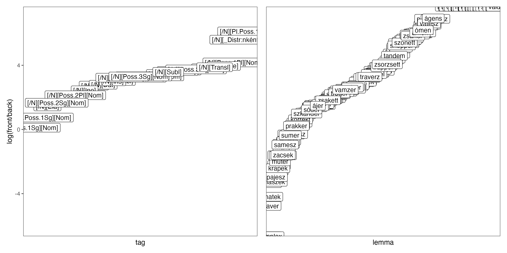{width=500}

---

lemma     xpostag                  suffix_initial   back          front         
--------  -----------------------  ---------------  ------------  --------------
haver     [/N][Ade]                C                havernál      havernél      
haver     [/N][All]                C                haverhoz      haverhez      
haver     [/N][Pl][Nom]            V                haverok       haverek       
haver     [/N][Poss.1Sg][Nom]      V                haverom       haverem       
partner   [/N][Ade]                C                partnernál    partnernél    
partner   [/N][All]                C                partnerhoz    partnerhez    
partner   [/N][Pl][Nom]            V                partnerok     partnerek     
partner   [/N][Poss.1Pl][Nom]      V                partnerunk    partnerünk    

---

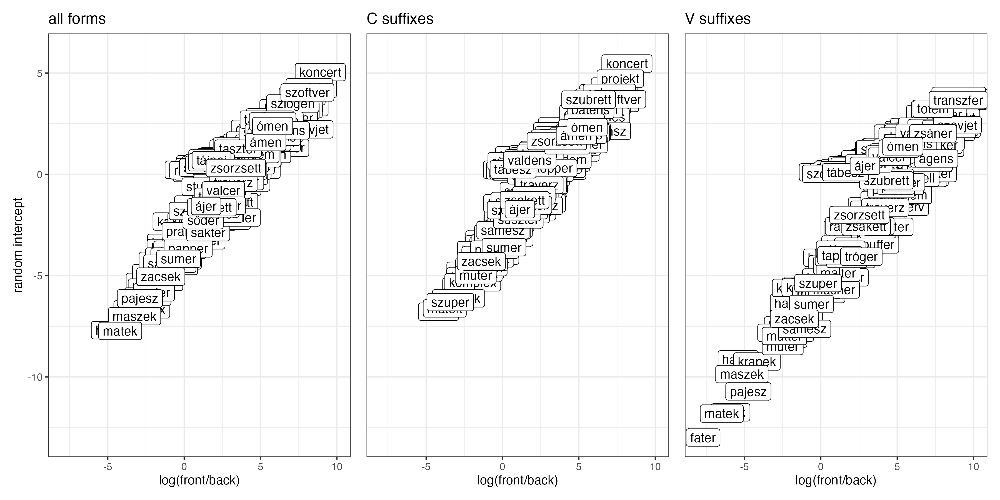{width=500}

---

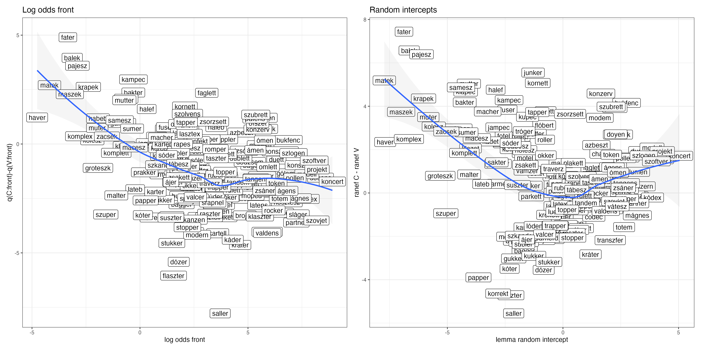{width=500}

---

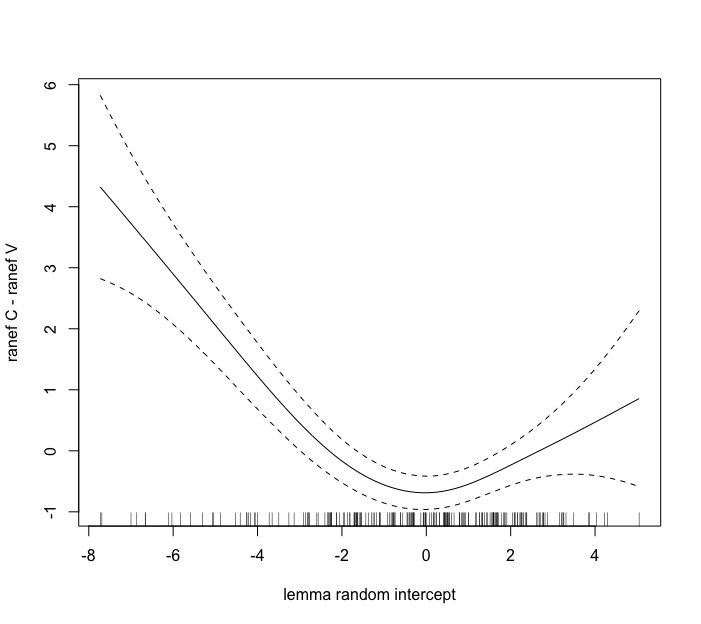{width=300}

---

- "egy bizonyos szint fölött nem megy az ember egy bizonyos szint alá" (ep)